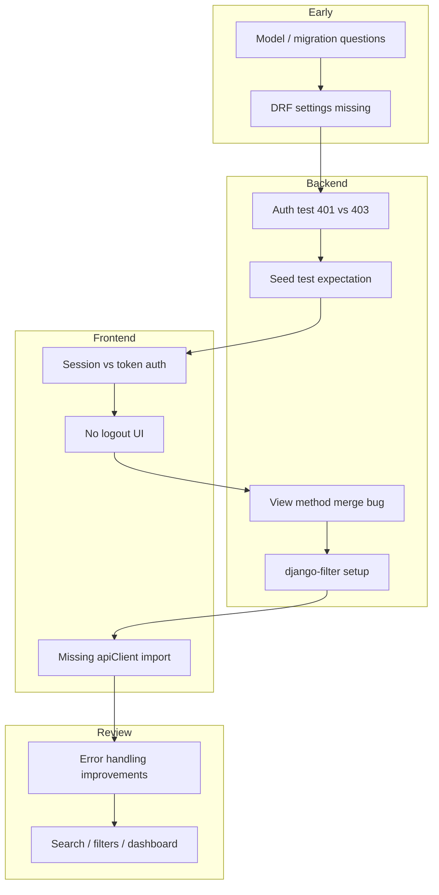

# Debugging

**Project:** Support Ticket Management System  
**Author:** Gajender Singh  
**Related:** `review-fixes.md` (post-review improvements), `testing.md` (verification), `final-ai-usage-summary.md` (AI-assisted debugging)

This document summarizes the **debugging prompts** used during development and the **major issues resolved** — symptoms, root causes, fixes, and how each was verified.

---

## Debugging Approach

Debugging followed a consistent workflow throughout the project:

| Step | Action |
|------|--------|
| 1. **Reproduce** | Run failing test, `npm run build`, or manual browser check |
| 2. **Isolate** | Read the affected file; compare expected vs actual behavior |
| 3. **Diagnose** | Trace error to root cause (config, merge conflict, missing import, auth mismatch) |
| 4. **Fix** | Minimal targeted change — no unrelated refactors |
| 5. **Verify** | Re-run `python manage.py test` and/or `npm run build` |

### Verification Commands Used

```bash
# Backend — after API, view, or permission changes
cd backend && source ../venv/bin/activate
python manage.py test                  # full suite (42 tests)
python manage.py test tickets -v 2     # targeted app

# Frontend — after component or API module changes
cd frontend && npm run build

# Manual — after UI or auth changes
# Start both servers, test with seed users (password123)
```

### Principles

1. **Read the file before applying fixes** — especially after partial AI edits that may have merged methods incorrectly.
2. **Trust test output over assumptions** — e.g. DRF returns 403 in some unauthenticated view tests, not always 401.
3. **Separate Django Admin session from React token auth** — they are different login systems.
4. **Build failures are fast feedback** — missing imports surface immediately in `npm run build`.
5. **Document gaps found during debugging** — e.g. no logout UI until Navbar was added.

---

## Debugging Prompts

These are the user questions and situations that triggered investigation, explanation, or fixes during development.

### 1. Model Design Clarification

**Prompt summary:**

> In the Ticket model file, why did you create multiple classes inside the Ticket class?

**Type:** Understanding (not a runtime bug)

**Resolution:** Explained that `Status`, `Priority`, and `Category` are Django `TextChoices` — enum definitions namespaced inside the model, not separate database tables.

---

### 2. Category Field Confusion

**Prompt summary:**

> Can you add a category field for IT Support, Access, Admin Issue, HR?

**Type:** Misunderstanding

**Resolution:** The `category` field already existed with different choices. Updated `Ticket.Category` choices and created migration `0002_alter_ticket_category`. No new field was needed.

---

### 3. Migration Status

**Prompts summary:**

> You have already run migrations command?  
> Can you migrate the Ticket model fields?  
> Can you migrate the Comment model fields?

**Type:** Environment / state verification

**Resolution:** Ran `showmigrations`, `makemigrations`, and `migrate`. Confirmed all Ticket and Comment migrations were already applied — database in sync with models. No pending migrations.

---

### 4. Django Admin Session vs React Login

**Prompt summary:**

> If I'm already logged in to Django, will that login session work automatically when I open the React application, or will I need to log in again?

**Type:** Auth architecture clarification

**Root cause:** Django Admin uses a **session cookie** on `:8000`. React uses **token auth** in `localStorage` on `:5173`. Different origins — cookies are not shared.

**Resolution:** Documented that React requires a separate login via `POST /api/auth/login/`. Token persists across browser reloads until `logout()` or `localStorage` is cleared. Session auth is enabled on the backend but not used by the React client.

---

### 5. No Logout in UI

**Prompt summary:**

> How can I log out?

**Type:** Missing feature / UX gap

**Symptom:** `AuthContext.logout()` existed but no UI button called it. Users had to clear `localStorage` manually via DevTools.

**Resolution:** Implemented `Navbar` with profile dropdown and **Logout** button → `logout()` + redirect to `/login`. Wrapped protected routes in `AppLayout`.

**Files:** `Navbar.jsx`, `AppLayout.jsx`, `AppRoutes.jsx`

---

### 6. Role Credentials

**Prompt summary:**

> Can you give me credentials for different roles?

**Type:** Manual testing aid

**Resolution:** Documented seed users from `python manage.py seed_data`:

| Username | Role | Password |
|----------|------|----------|
| `customer_alice` | Customer | `password123` |
| `customer_bob` | Customer | `password123` |
| `agent_sarah` | Agent | `password123` |
| `agent_mike` | Agent | `password123` |
| `admin_diana` | Admin | `password123` |

---

## Major Issues Resolved (Code & Config)

These issues were discovered during implementation, testing, or builds — not always via explicit user prompts.

### 7. DRF Not Registered in Settings

**When:** Serializer implementation step

**Symptom:** Serializers could not be validated; DRF not fully configured.

**Root cause:** `rest_framework` was installed via pip but missing from `INSTALLED_APPS`.

**Fix:** Added `'rest_framework'` to `backend/config/settings.py`.

**Verified:** Serializer module importable; subsequent API views worked.

---

### 8. Unauthenticated Test Expected 401, Got 403

**When:** Ticket API tests (`test_list_tickets_requires_authentication`)

**Symptom:** Test failed — expected `401 Unauthorized`, received `403 Forbidden`.

**Root cause:** DRF's default behavior for unauthenticated requests to views with `IsAuthenticated` can return either 401 or 403 depending on authentication class order and request context.

**Fix:** Updated assertion to accept both:

```python
self.assertIn(
    response.status_code,
    (status.HTTP_401_UNAUTHORIZED, status.HTTP_403_FORBIDDEN),
)
```

**File:** `backend/tickets/tests.py`

---

### 9. `get_serializer_class` Merged Into `get_queryset`

**When:** Search/filter and dashboard implementation (refactoring `tickets/views.py`)

**Symptom:** Ticket list API broken — wrong serializer used on POST; possible `AttributeError` or incorrect responses.

**Root cause:** During a multi-edit refactor, `get_serializer_class()` body was accidentally placed inside `get_queryset()`, leaving `get_serializer_class` undefined or malformed.

**Before (broken):**
```python
def get_queryset(self):
    return get_scoped_ticket_queryset(self.request.user)
    if self.request.method == "POST":
        return TicketCreateSerializer
    return TicketListSerializer
```

**Fix:** Restored separate methods:

```python
def get_queryset(self):
    return get_scoped_ticket_queryset(self.request.user)

def get_serializer_class(self):
    if self.request.method == "POST":
        return TicketCreateSerializer
    return TicketListSerializer
```

**File:** `backend/tickets/views.py`

**Verified:** `python manage.py test tickets` — all ticket tests pass.

---

### 10. Missing `apiClient` Import in `tickets.js`

**When:** Dashboard implementation (editing `frontend/src/api/tickets.js`)

**Symptom:** `npm run build` failed — `apiClient is not defined`.

**Root cause:** `import { apiClient } from './client'` was accidentally removed during a file edit that added `getTicketStats()`.

**Fix:** Restored the import at the top of `tickets.js`.

**Verified:** `npm run build` succeeds.

---

### 11. `django-filter` Not Installed

**When:** Search and filter feature implementation

**Symptom:** Backend filter support required `django-filter` package and `django_filters` in `INSTALLED_APPS`.

**Root cause:** Filter library not yet added to the project.

**Fix:**
- Installed `django-filter`
- Added `'django_filters'` to `INSTALLED_APPS`
- Registered `DjangoFilterBackend` in DRF settings
- Created `backend/tickets/filters.py` with `TicketFilter`

**Verified:** Filter tests pass; frontend search/filters work against API.

---

### 12. Seed Data `--clear` Test Expectation Wrong

**When:** Seed data command tests

**Symptom:** `test_seed_data_clear_removes_seed_records` failed — expected 0 tickets after `--clear`, but `--clear` re-seeds data.

**Root cause:** Test assumed `--clear` only deletes records. Actual behavior: `--clear` removes seed data then recreates it.

**Fix:** Renamed and rewrote test as `test_seed_data_clear_recreates_records` — asserts ticket count is restored after `--clear`.

**File:** `backend/tickets/test_seed_data.py`

---

### 13. Comment View Indentation

**When:** Comment API implementation

**Symptom:** Inconsistent indentation on `permission_classes = []` comment line.

**Root cause:** Copy-paste formatting error during initial view creation.

**Fix:** Corrected indentation in `CommentListCreateView`. No behavior change.

**File:** `backend/comments/views.py`

---

## Post-Review Fixes (Quality Issues)

These were identified during self-review (`code-review-notes.md`) rather than runtime crashes, but address real usability and consistency gaps.

| Issue | Symptom | Fix |
|-------|---------|-----|
| No search/filters on ticket list | Hard to find tickets in large queues | `TicketFilter` + `TicketFilters.jsx` |
| Dashboard placeholder only | No operational visibility | `GET /api/tickets/stats/` + `DashboardPage` |
| Silent status updates | No feedback on workflow actions | `Notification` toast component |
| API errors not parsed consistently | Generic error messages in forms | `getApiErrorMessage()`, `getApiFieldErrors()` |
| Stale token after expiry | User appeared logged in but API failed | `AuthContext` clears session on failed `/api/auth/me/` |
| Client validation missing on ticket form | Server-only validation felt slow | `validateForm()` in `TicketForm.jsx` |
| Duplicated role scoping in views | Risk of inconsistent queryset logic | `get_scoped_ticket_queryset()` helper |

Full details: `review-fixes.md`

---

## Issues by Layer

| Layer | Issues | Primary verification |
|-------|--------|----------------------|
| **Config** | DRF not in `INSTALLED_APPS`, `django-filter` missing | `manage.py check`, imports |
| **Backend views** | `get_queryset` / `get_serializer_class` merge | `python manage.py test tickets` |
| **Backend tests** | 401 vs 403 assertion, seed `--clear` expectation | Test runner |
| **Frontend API** | Missing `apiClient` import | `npm run build` |
| **Auth / UX** | Session vs token confusion, no logout UI | Manual browser testing |
| **Data / migrations** | "Are migrations applied?" questions | `showmigrations` |

---

## Debugging Timeline



---

## Common Debugging Patterns

### Backend API not behaving as expected

1. Check `permission_classes` and role scoping in `get_scoped_ticket_queryset()`
2. Confirm token is sent: `Authorization: Token <key>`
3. Remember unauthorized ticket access returns **404**, not 403 (by design)
4. Use DRF browsable API at `http://127.0.0.1:8000/api/` for quick inspection

### Frontend API call fails

1. Confirm Django is running on `:8000` and Vite proxy is configured
2. Check `localStorage` for `auth_token`
3. Inspect network tab for status code and response body
4. Use `getApiErrorMessage()` output — handles `detail`, field errors, `non_field_errors`

### Tests fail after view edits

1. Read the full view file — look for merged or duplicated methods
2. Run targeted tests: `python manage.py test tickets.tests -v 2`
3. Check whether `APIRequestFactory` tests need `force_authenticate`

### Build fails after frontend edits

1. Run `npm run build` — surfaces missing imports immediately
2. Check API module imports (`api/tickets.js`, `api/comments.js`)
3. Verify new components are imported in routes/pages

---

## Unresolved / Known Gaps

These are documented limitations, not bugs fixed in this cycle:

| Gap | Notes |
|-----|-------|
| Workflow constants duplicated | Backend `workflow.py` and frontend `constants.js` can drift |
| No frontend automated tests | Regressions caught by manual QA only |
| No `requirements.txt` | Dependency versions not pinned in repo |
| Pagination not automated | Verified manually |

---

## Prompt Summary Table

| # | Prompt / Trigger | Type | Outcome |
|---|------------------|------|---------|
| 1 | Why multiple classes in Ticket? | Clarification | TextChoices explained |
| 2 | Add category field | Misunderstanding | Choices updated, not new field |
| 3 | Migration status questions | Verification | Confirmed DB in sync |
| 4 | Django session vs React login | Auth architecture | Documented separate logins |
| 5 | How can I log out? | Missing UI | Navbar + logout implemented |
| 6 | Credentials for roles | Testing aid | Seed users documented |
| 7 | DRF settings | Config bug | `rest_framework` added to settings |
| 8 | 401 vs 403 test failure | Test fix | Assertion accepts both codes |
| 9 | View method merge | Code bug | `get_serializer_class` restored |
| 10 | Missing `apiClient` import | Build failure | Import restored in `tickets.js` |
| 11 | `django-filter` missing | Dependency | Package + config added |
| 12 | Seed `--clear` test wrong | Test bug | Test rewritten for actual behavior |
| 13 | Comment view indentation | Formatting | Indentation corrected |

---

## Related Documents

| Document | Focus |
|----------|-------|
| **`debugging.md`** (this file) | Debugging prompts and resolved issues |
| **`review-fixes.md`** | Post-review UI, validation, and API improvements |
| **`testing.md`** | How fixes were verified with tests |
| **`code-review-notes.md`** | Self-review findings that drove fixes |
| **`final-ai-usage-summary.md`** | AI role in debugging vs human verification |

---

## Document Control

| Field | Value |
|-------|-------|
| **Project** | Support Ticket Management System |
| **Author** | Gajender Singh |
| **Major Issues Resolved** | 13 |
| **Debugging Prompts** | 6 explicit user prompts + 7 code/config issues |
| **Status** | Reflects resolved issues through July 2026 |
