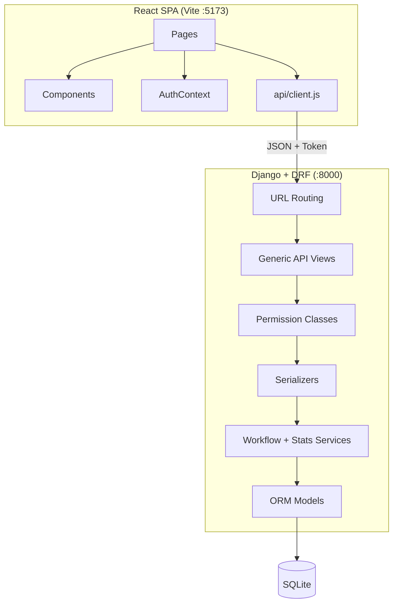
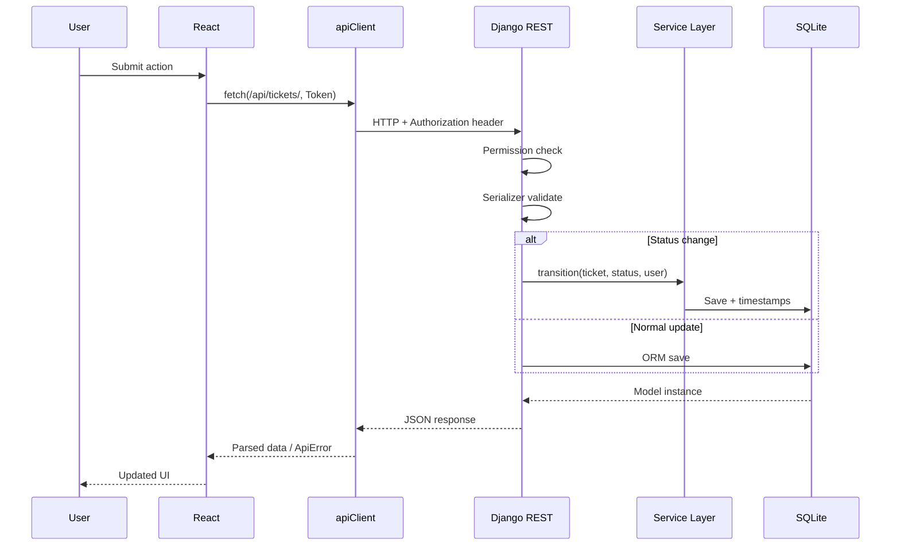

# Design

**Project:** Support Ticket Management System  
**Author:** Gajender Singh  
**Related:** `design-notes.md` (detailed rationale), `planning.md` (full prompt timeline)

This document summarizes the **design prompts** used during development and the **architectural decisions** they produced.

---

## Design Approach

Every design phase followed the same workflow:

1. **Prompt** — ask for explanation and trade-offs before code
2. **Review** — evaluate AI recommendations against project requirements
3. **Decide** — lock in architecture, schema, or API contract
4. **Implement** — generate code for that scope only
5. **Verify** — migrations, tests, or manual checks

Design prompts consistently included: *"Don't generate code yet"* or *"Let's focus only on [X]"* to prevent premature implementation.

---

## Design Prompts Summary

### 1. System Architecture

**Prompt:**

> *Help me design the application before we start coding. Tech stack: Django, DRF, React (Vite), SQLite. I want the architecture to be clean, modular, and easy to maintain. Explain: high-level architecture, backend folder structure, frontend folder structure, database relationships, API request flow, where validation should happen, where business logic should live, how ticket status workflow should be implemented, how authentication and permissions should be organized, how the project should scale. Don't generate code yet.*

**Follow-up:** *Use of this module relationship?* — clarified app-level dependencies vs entity relationships.

**Outcome:** Decoupled SPA + REST API; three Django apps; service layer for workflow; serializers for validation; token auth for React.

---

### 2. Ticket Data Model

**Prompt:**

> *Explain which fields the Ticket model should contain and why. Explain the purpose of every field before generating the Django model. After generating: explain relationships, field types, validations to add later. Focus only on the Ticket model.*

**Follow-ups:**
- *Why multiple classes inside Ticket?* → `TextChoices` for enums
- *Add categories: IT Support, Access, Admin Issue, HR* → updated `Category` choices

**Outcome:** `Ticket` model with status, priority, category, assignment, timestamps, auto `ticket_number`.

---

### 3. Comment Data Model

**Prompt:**

> *Before generating any code, explain: what fields the Comment model should contain, how it relates to Ticket, whether comments link to users, what happens on ticket delete, whether timestamps are needed, validations and best practices. Then generate the model. Focus only on the Comment model.*

**Outcome:** `Comment` with `ticket` FK (CASCADE), `author` FK (PROTECT), `body`, `is_internal`, `created_at`.

---

### 4. Django Admin

**Prompt:**

> *Explain: why Django Admin is useful, what to display in Ticket/Comment list views, searchable fields, filters, read-only fields. Then generate admin.py. Focus only on admin configuration.*

**Outcome:** `TicketAdmin` with list display, filters, search; `CommentInline` on ticket detail.

---

### 5. DRF Serializers

**Prompt:**

> *Implement serializers for Ticket and Comment. Include field validation, read-only fields, helpful comments. Focus only on serializers — no views or URLs.*

**Outcome:** Separate list, detail, and create serializers per resource; nested `UserSummarySerializer`.

---

### 6. API Layer Design

**Prompt:**

> *Before implementing API views, design the API layer. Explain: required endpoints and why, HTTP methods per endpoint, whether to use APIView vs GenericAPIView vs ModelViewSet (with trade-offs). Recommend the best approach. Don't generate views or URLs yet.*

**Outcome:** RESTful endpoints under `/api/auth/`, `/api/tickets/`, `/api/comments/`; **generic class-based views** chosen over ViewSets.

---

### 7. Authentication & Permissions

**Prompt:**

> *Implement authentication and permissions for Ticket and Comment APIs following DRF best practices. Focus only on auth and permissions — no frontend login yet.*

**Outcome:** Token auth; `TicketPermission` and `CommentPermission`; `UserProfile` with roles; 404 for unauthorized ticket access.

---

### 8. Ticket Workflow

**Prompt:**

> *Before generating code, explain: valid status transitions, where business logic should live (model vs serializer vs view vs service), how invalid transitions are handled, how to test. Then implement workflow logic. Focus only on workflow — no frontend.*

**Outcome:** `tickets/services/workflow.py` with `AGENT_TRANSITIONS`, `CUSTOMER_TRANSITIONS`, timestamp side effects.

---

### 9. Frontend Architecture

**Prompt:**

> *Before generating React code, explain: overall frontend architecture, app organization, pages needed, reusable components, API communication, auth handling, React best practices. Recommend folder structure. Don't generate code yet.*

**Outcome:** `api/`, `components/`, `context/`, `pages/`, `routes/`, `utils/` structure; `AuthContext`; protected routes.

---

### 10. UI Component Design (per page)

Each frontend feature used a scoped design prompt:

| Feature | Design Focus |
|---------|--------------|
| Ticket List | Cards, badges, loading/error/empty states |
| Ticket Detail | Metadata layout, back navigation |
| Create / Edit | Shared `TicketForm` with create/edit modes |
| Comments | Thread display, internal note checkbox for agents |
| Status Workflow | Role-specific transition controls |
| Search & Filters | Debounced search, dropdown filters, clear button |
| Dashboard | Role-specific stat cards, status breakdown, recent tickets |

---

## High-Level Architecture



| Layer | Responsibility |
|-------|----------------|
| **React pages** | Route-level data fetching and layout |
| **React components** | Reusable UI (cards, forms, badges, filters) |
| **API client** | HTTP, token attachment, error parsing |
| **DRF views** | HTTP method handling, queryset scoping |
| **Permissions** | Role-based access at API boundary |
| **Serializers** | Validation, JSON shaping, nested relations |
| **Services** | Workflow rules, dashboard aggregation |
| **Models** | Schema, indexes, relationships |

---

## Architectural Decisions

### Stack

| Layer | Choice | Prompt / Decision Source |
|-------|--------|------------------------|
| Backend framework | Django 4.2 | Architecture prompt |
| API framework | Django REST Framework | Architecture prompt |
| Frontend | React 19 + Vite | Architecture prompt |
| Database | SQLite | Architecture prompt; dev/demo scope |
| Auth | DRF Token Authentication | Frontend architecture prompt |
| Filtering | django-filter | Ticket list enhancement |

### Backend Structure

| Decision | Choice | Rationale |
|----------|--------|-----------|
| App organization | `accounts`, `tickets`, `comments` | Domain separation (architecture prompt) |
| API view pattern | Generic class-based views | API design prompt — explicit URLs over ViewSets |
| Business logic | Service layer (`workflow.py`, `stats.py`) | Workflow design prompt |
| Validation | Serializers | Architecture prompt — API boundary |
| Role storage | `UserProfile` one-to-one with User | Auth design — avoid custom user model |
| Queryset scoping | `get_scoped_ticket_queryset()` | Refactored during filter/dashboard work |
| Pagination | DRF `PageNumberPagination`, size 20 | API design |
| List vs detail payload | Separate serializers | Serializer design prompt |

### Data Model

| Entity | Key Design Choice | Prompt |
|--------|-------------------|--------|
| **Ticket** | Auto `ticket_number`, workflow statuses, assignment nullable | Ticket model prompt |
| **Ticket** | Categories: IT Support, Access, Admin Issue, HR | Follow-up prompt |
| **Ticket** | `resolved_at` / `closed_at` set by workflow, not user input | Workflow prompt |
| **Comment** | `is_internal` flag instead of separate model | Comment model prompt |
| **Comment** | CASCADE on ticket delete; PROTECT on author | Comment model prompt |
| **UserProfile** | Auto-created via `post_save` signal | Auth implementation |

### Security & Permissions

| Decision | Implementation | Design Rationale |
|----------|----------------|------------------|
| Default deny | `IsAuthenticated` on all endpoints | API design |
| Ticket access | Customers: own tickets only | Requirements |
| Unauthorized ticket | Return **404**, not 403 | Security design — no ID leakage |
| Internal comments | Hidden from customers at queryset level | Comment model + permissions |
| Delete tickets | Agents/admins only | Permission design |
| Password storage | Django hashed passwords | Auth best practice |

### API Contract

| Resource | Endpoints | Methods |
|----------|-----------|---------|
| Auth | `/api/auth/register/`, `login/`, `me/` | POST, GET |
| Tickets | `/api/tickets/`, `/api/tickets/{id}/`, `/api/tickets/stats/` | GET, POST, PATCH, DELETE |
| Comments | `/api/comments/`, `/api/comments/{id}/` | GET, POST, PATCH, DELETE |

**Query parameters (tickets list):** `page`, `search`, `status`, `priority`, `category`

### Workflow Design

**Agent transitions** (from workflow design prompt):

| From | To |
|------|-----|
| Open | In Progress, Closed |
| In Progress | Waiting on Customer, Resolved, Closed |
| Waiting on Customer | In Progress |
| Resolved | Closed, Reopened |
| Reopened | In Progress |
| Closed | Reopened |

**Customer transitions:** Reopen only from Resolved or Closed.

**Timestamp rules:** `resolved_at` on resolve; `closed_at` on close; both cleared on reopen.

### Frontend Structure

```
frontend/src/
├── api/           # client.js, auth.js, tickets.js, comments.js
├── components/
│   ├── common/    # LoadingSpinner, ErrorMessage, EmptyState, Badge
│   ├── layout/    # Navbar, AppLayout
│   ├── tickets/   # TicketCard, TicketForm, TicketFilters, ...
│   ├── comments/  # CommentList, CommentForm, CommentItem
│   └── dashboard/ # StatCard, StatusBreakdown
├── context/       # AuthContext
├── pages/         # Route-level components
├── routes/        # ProtectedRoute, GuestRoute, AppRoutes
└── utils/         # constants, errors, formatters
```

| Decision | Choice | Rationale |
|----------|--------|-----------|
| Global state | `AuthContext` only | Frontend architecture prompt |
| Route protection | `ProtectedRoute` + `GuestRoute` | Frontend architecture prompt |
| API errors | `getApiErrorMessage()`, `getApiFieldErrors()` | Error handling design |
| Styling | Co-located CSS, BEM-like naming | UI component prompts |
| Dev proxy | Vite `/api` → Django :8000 | Foundation implementation |
| Form reuse | `TicketForm` create/edit modes | Create/Edit page prompts |

### UI / UX Design

| Area | Decision |
|------|----------|
| Ticket list | Card layout with status/priority badges |
| Filters | Panel above list; debounced search (300ms) |
| Dashboard | Role-specific: customer (active, waiting on you) vs agent (pipeline, unassigned, urgent) |
| Empty states | Contextual — no tickets vs no filter matches |
| Status actions | Dropdown + quick buttons; hidden when no transitions allowed |
| Comments | Chronological thread; internal badge for agents |
| Responsive | Navbar hamburger; filter grid stacks on mobile |
| Navigation | Persistent navbar: Dashboard, Tickets, Create Ticket, profile/logout |

---

## Request Flow



---

## Design Decisions Not Implemented (Deferred)

| Item | Reason Deferred |
|------|-----------------|
| `common` Django app | Simplified to three apps; helpers live in each app |
| JWT / refresh tokens | Token auth sufficient for scope |
| Nested `/api/tickets/{id}/comments/` | Flat `/api/comments/?ticket=` chosen for simplicity |
| Redux / Zustand | Context + local state sufficient |
| Assignment UI | Model supports it; UI deferred |
| API for allowed transitions | Frontend constants mirror backend (known drift risk) |
| PostgreSQL / production settings | Out of demo scope |

---

## Design Documents Map

| Document | Focus |
|----------|-------|
| **`design.md`** (this file) | Design prompts + architectural decisions summary |
| **`design-notes.md`** | Detailed rationale for each technology choice |
| **`data-model.md`** | Database schema, relationships, business rules |
| **`api-contract.md`** | Full API endpoint reference |
| **`ui-flow.md`** | Page navigation and user journeys |
| **`planning.md`** | Complete planning prompt timeline |

---

## Document Control

| Field | Value |
|-------|-------|
| **Project** | Support Ticket Management System |
| **Author** | Gajender Singh |
| **Status** | Design finalized and implemented |
