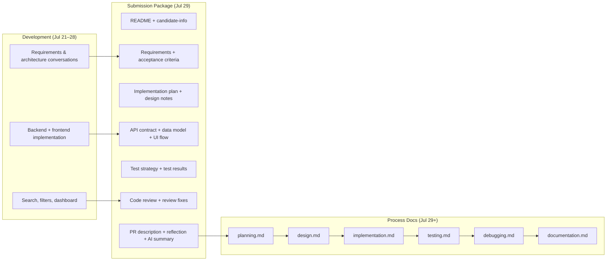

# Documentation

**Project:** Support Ticket Management System  
**Author:** Gajender Singh  
**Related:** `final-ai-usage-summary.md` (AI role in docs), `planning.md` (planning prompts)

This document summarizes the **prompts used to generate project documentation** — what was requested, what each file contains, and how the documentation suite is organized.

---

## Documentation Approach

Documentation was generated **after the application was complete**, in a dedicated submission phase (July 29, 2026). Each prompt followed a consistent pattern:

1. **Single-file scope** — most prompts said "Generate only `filename.md`" or named one deliverable
2. **Structured sections** — prompts listed required headings or topics
3. **Project-specific content** — instructions to base docs on the actual implementation, not speculation
4. **Human review** — every file was checked against the codebase, tests, and manual QA before acceptance

### Principles

| Principle | Application |
|-----------|-------------|
| **Describe what exists** | Docs reflect implemented features, not planned ones |
| **One prompt, one file** | Each submission doc generated independently |
| **Tables and checklists** | Used where prompts requested structured output (API contract, test results, acceptance criteria) |
| **Cross-reference** | Meta-docs (`planning.md`, `implementation.md`) link to detailed docs |
| **Honest gaps** | Known limitations documented in test strategy, code review, and reflection |

### Verification Workflow

```
Generate doc from prompt
    → Review against actual code / tests / browser
    → Correct inaccuracies
    → Use as submission artifact or process reference
```

Backend docs verified with `python manage.py test`. Frontend flows verified against `acceptance-criteria.md` and `npm run build`.

---

## Submission Package Prompts (Phase 8)

These prompts were issued on **July 29, 2026** after the application was feature-complete. They produced the core submission documentation suite.

### 1. README.md

**Prompt summary:**

> My Support Ticket Management System is complete. Generate a professional README.md. Include: project overview, features, technology stack, project structure, installation steps, backend setup, frontend setup, database setup, running the application, running tests, API overview, default test users, future improvements. **Generate only README.md.**

**Deliverable:** Primary project entry point — setup, run, test, and API reference for developers.

---

### 2. candidate-info.md

**Prompt summary:**

> Generate `candidate-info.md`. Include: Candidate Name (Gajender Singh), Project Name, Technologies Used, Development Environment, Submission Date, GitHub Repository placeholder. Keep it professional.

**Deliverable:** Submission metadata for coursework/delivery.

---

### 3. requirements-analysis.md

**Prompt summary:**

> Generate `requirements-analysis.md`. Summarize: functional requirements, non-functional requirements, assumptions, constraints, key business rules. **Base everything on this project only.**

**Deliverable:** Formal requirements document derived from implemented features and early planning decisions.

**Source material:** Early requirements and architecture conversations informed this content.

---

### 4. acceptance-criteria.md

**Prompt summary:**

> Generate `acceptance-criteria.md`. Create acceptance criteria for every implemented feature: Login, Registration, Ticket List, Ticket Details, Create Ticket, Edit Ticket, Comments, Ticket Workflow, Search, Filters, Pagination. **Use a checklist format.**

**Deliverable:** Manual QA checklists — primary frontend verification guide.

---

### 5. implementation-plan.md

**Prompt summary:**

> Generate `implementation-plan.md`. Describe the implementation in chronological order. Explain: Planning, Backend, Authentication, APIs, Frontend, Testing, Final polish. **Write it as an implementation timeline.**

**Deliverable:** Seven-phase build timeline with dependency graph.

---

### 6. design-notes.md

**Prompt summary:**

> Generate `design-notes.md`. Explain: Why Django REST Framework, Why React, Why SQLite, Why Token Authentication, Why React Context, Why reusable components, Why REST APIs. Explain the architectural decisions made during development.

**Deliverable:** Technology and architecture rationale (the "why" behind stack choices).

---

### 7. api-contract.md

**Prompt summary:**

> Generate `api-contract.md`. Document every API endpoint including: Method, URL, Request, Response, Authentication, Validation, Errors. **Use Markdown tables where appropriate.**

**Deliverable:** Complete REST API reference for auth, tickets, and comments endpoints.

---

### 8. data-model.md

**Prompt summary:**

> Generate `data-model.md`. Explain the database design. Include: User, Ticket, Comment, Relationships, Field descriptions, Business rules. **Keep it implementation-specific.**

**Deliverable:** Schema documentation aligned with Django models and migrations.

---

### 9. ui-flow.md

**Prompt summary:**

> Generate `ui-flow.md`. Describe every page: Login, Register, Dashboard, Ticket List, Ticket Detail, Create Ticket, Edit Ticket. Explain how users navigate through the application.

**Deliverable:** Page-by-page UI description and navigation flows by role.

---

### 10. test-strategy.md

**Prompt summary:**

> Generate `test-strategy.md`. Explain: Backend testing, Frontend testing, Manual testing, Authentication testing, Workflow testing, API testing, Edge cases, Validation testing.

**Deliverable:** Comprehensive testing approach — automated, manual, and coverage gaps.

---

### 11. test-results.md

**Prompt summary:**

> Generate `test-results.md`. Summarize completed tests. Include: Authentication, CRUD, Comments, Workflow, Search, Filters, Pagination, Overall result. **Present it as a table.**

**Deliverable:** 42/42 PASS results from live `python manage.py test` run.

---

### 12. code-review-notes.md

**Prompt summary:**

> Generate `code-review-notes.md`. Review the project and identify: Strengths, Code organization, Maintainability, Reusability, Security, Performance, Possible improvements.

**Deliverable:** Self-review with strengths, gaps, and improvement recommendations.

---

### 13. review-fixes.md

**Prompt summary:**

> Generate `review-fixes.md`. Summarize improvements made after reviewing the project. Include: UI improvements, Validation, Refactoring, Error handling, API improvements, Performance improvements.

**Deliverable:** Post-review changes (search/filters, dashboard, error handling, refactoring).

---

### 14. pr-description.md

**Prompt summary:**

> Generate `pr-description.md`. Write a professional Pull Request description. Include: Summary, Features added, Testing performed, Screenshots placeholder, Checklist.

**Deliverable:** PR-ready description of the full feature set.

---

### 15. reflection.md

**Prompt summary:**

> Generate `reflection.md`. Reflect on: What was learned, Challenges, AI-assisted development, Architecture decisions, Future improvements, Lessons learned. **Write in first person.**

**Deliverable:** Personal reflection on the project experience.

---

### 16. final-ai-usage-summary.md

**Prompt summary:**

> Generate `final-ai-usage-summary.md`. Summarize: How AI was used — Planning, Design, Implementation, Debugging, Testing, Documentation. Explain that AI assisted development while all generated code was reviewed, tested, and refined before acceptance.

**Deliverable:** AI usage disclosure and statement of responsibility.

---

## Process Documentation Prompts (Phase 9)

After the submission package, additional prompts generated **meta-documentation** summarizing prompts and approaches used during development.

| # | Document | Prompt Summary |
|---|----------|----------------|
| 17 | `planning.md` | Summarize planning prompts and key decisions throughout the project |
| 18 | `design.md` | Summarize design prompts and architectural decisions |
| 19 | `implementation.md` | Summarize implementation prompts for backend and frontend development |
| 20 | `testing.md` | Summarize testing prompts and testing approach |
| 21 | `debugging.md` | Summarize debugging prompts and major issues resolved |
| 22 | `documentation.md` | Summarize prompts used to generate project documentation (this file) |

These files document **how** the project was built, complementing the **what** covered in the submission package.

---

## Documentation Prompt Summary

| # | File | Category | Key Prompt Theme |
|---|------|----------|------------------|
| 1 | `README.md` | Setup & reference | Professional README with install, run, test, API |
| 2 | `candidate-info.md` | Submission | Candidate and project metadata |
| 3 | `requirements-analysis.md` | Requirements | Functional/non-functional reqs, rules, constraints |
| 4 | `acceptance-criteria.md` | QA | Checklist per feature |
| 5 | `implementation-plan.md` | Timeline | Chronological build phases |
| 6 | `design-notes.md` | Architecture | Why DRF, React, SQLite, token auth, etc. |
| 7 | `api-contract.md` | API | Every endpoint with request/response/errors |
| 8 | `data-model.md` | Database | User, Ticket, Comment schema and rules |
| 9 | `ui-flow.md` | Frontend | Pages and navigation by role |
| 10 | `test-strategy.md` | Testing | Backend, manual, workflow, API testing approach |
| 11 | `test-results.md` | Testing | 42/42 pass results in tables |
| 12 | `code-review-notes.md` | Review | Strengths, gaps, improvements |
| 13 | `review-fixes.md` | Review | Post-review fixes applied |
| 14 | `pr-description.md` | Delivery | Pull request description |
| 15 | `reflection.md` | Reflection | First-person lessons learned |
| 16 | `final-ai-usage-summary.md` | AI disclosure | How AI assisted; human review statement |
| 17 | `planning.md` | Process | Planning prompts timeline |
| 18 | `design.md` | Process | Design prompts and decisions |
| 19 | `implementation.md` | Process | Implementation prompts (backend + frontend) |
| 20 | `testing.md` | Process | Testing prompts and approach |
| 21 | `debugging.md` | Process | Debugging prompts and resolved issues |
| 22 | `documentation.md` | Process | Documentation prompts (this file) |

**Total documentation files:** 22 (project root) + `frontend/README.md` (Vite scaffold, not prompt-generated)

---

## Document Catalog by Purpose

### Getting Started

| Document | Audience | Purpose |
|----------|----------|---------|
| `README.md` | Developers | Install, run, test, API overview |
| `candidate-info.md` | Reviewers | Submission metadata |

### Requirements & Design

| Document | Audience | Purpose |
|----------|----------|---------|
| `requirements-analysis.md` | Reviewers | What the system must do |
| `design-notes.md` | Architects | Why technologies were chosen |
| `design.md` | Developers | Design prompts and decisions |
| `data-model.md` | Backend devs | Database schema and rules |
| `api-contract.md` | API consumers | Endpoint reference |

### Implementation & Process

| Document | Audience | Purpose |
|----------|----------|---------|
| `implementation-plan.md` | Reviewers | Build timeline |
| `implementation.md` | Developers | Implementation prompts used |
| `planning.md` | Reviewers | Planning prompts and decisions |
| `ui-flow.md` | QA / UX | Page flows and navigation |

### Quality Assurance

| Document | Audience | Purpose |
|----------|----------|---------|
| `acceptance-criteria.md` | QA | Feature checklists |
| `test-strategy.md` | QA / Devs | Testing approach |
| `test-results.md` | Reviewers | Test run evidence |
| `testing.md` | Developers | Testing prompts used |

### Review & Delivery

| Document | Audience | Purpose |
|----------|----------|---------|
| `code-review-notes.md` | Reviewers | Self-assessment |
| `review-fixes.md` | Reviewers | Improvements after review |
| `debugging.md` | Developers | Issues resolved during development |
| `pr-description.md` | Reviewers | PR summary |
| `reflection.md` | Reviewers | Personal reflection |
| `final-ai-usage-summary.md` | Reviewers | AI usage disclosure |

### Meta

| Document | Audience | Purpose |
|----------|----------|---------|
| `documentation.md` | Reviewers | This file — documentation prompt index |

---

## Documentation Timeline



---

## Prompt Template Used

Most documentation prompts followed this structure:

```
Generate [filename].md.

[Optional context: "My project is complete."]

Include:
- [section 1]
- [section 2]
- ...

[Format instruction: checklist / tables / first person / chronological]

[Scope limit: "Generate only README.md" / "Base on this project only"]
```

**Examples:**

- **Scoped:** "Generate only README.md"
- **Format:** "Use a checklist format" / "Present it as a table"
- **Accuracy:** "Base everything on this project only" / "Keep it implementation-specific"
- **Voice:** "Write in first person" (`reflection.md`)

---

## Relationship Between Documents

```
requirements-analysis.md ──► acceptance-criteria.md (QA validates reqs)
        │
        ▼
design-notes.md ◄──► data-model.md + api-contract.md
        │
        ▼
implementation-plan.md ◄──► implementation.md (prompts detail)
        │
        ▼
test-strategy.md ──► test-results.md ──► testing.md (prompts detail)
        │
        ▼
code-review-notes.md ──► review-fixes.md
        │
        ▼
pr-description.md + reflection.md + final-ai-usage-summary.md
        │
        ▼
planning.md + design.md + debugging.md + documentation.md (process layer)
```

---

## Review Checklist Applied to All Docs

Before accepting any generated documentation:

- [ ] Commands in README run successfully
- [ ] API endpoints match `urls.py` and views
- [ ] Model fields match `models.py` and migrations
- [ ] Test counts match `python manage.py test` output
- [ ] Acceptance criteria reflect actual UI behavior
- [ ] Known gaps documented (no frontend tests, no `requirements.txt`, etc.)
- [ ] No features described that were not implemented

---

## Related Documents

| Document | Focus |
|----------|-------|
| **`documentation.md`** (this file) | Prompts used to generate all project docs |
| **`final-ai-usage-summary.md`** | AI role in documentation and human review |
| **`planning.md`** | Planning prompts (pre-documentation phase) |
| **`README.md`** | Primary developer entry point |

---

## Document Control

| Field | Value |
|-------|-------|
| **Project** | Support Ticket Management System |
| **Author** | Gajender Singh |
| **Submission Docs** | 16 |
| **Process Docs** | 6 |
| **Total Project Docs** | 22 (+ Vite `frontend/README.md`) |
| **Documentation Phase** | July 29, 2026 |
| **Status** | Complete |
