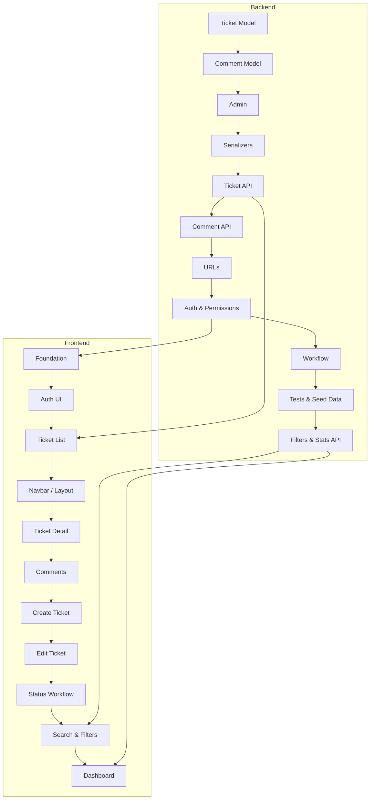

# Implementation

**Project:** Support Ticket Management System  
**Author:** Gajender Singh  
**Related:** `planning.md` (full timeline), `design.md` (design prompts), `implementation-plan.md` (phases)

This document summarizes the **implementation prompts** used during backend and frontend development — what was requested, what was explicitly excluded, and what was delivered.

---

## Implementation Approach

Each prompt followed a consistent pattern:

1. **Context** — state what is already complete
2. **Request** — list specific deliverables to generate
3. **Scope limit** — name what *not* to build yet
4. **Verify** — run migrations, tests, or manual checks before the next prompt

This incremental approach kept each step small, reviewable, and testable.

---

## Backend Implementation Prompts

### 1. Ticket Model

**Prompt summary:**

> Explain every Ticket field and why it is needed. Then generate the Django model with relationships, field types, and notes on future validation. Focus only on the Ticket model — no serializers, views, or APIs.

**Deliverables:**
- `backend/tickets/models.py` — `Ticket` with status, priority, category, assignment, timestamps
- Auto-generated `ticket_number` in `save()`
- Migration `tickets/0001_initial`

**Excluded:** Serializers, views, APIs

---

### 2. Category Update

**Prompt summary:**

> Add category values: IT Support, Access, Admin Issue, HR.

**Deliverables:**
- Updated `Ticket.Category` choices
- Migration `tickets/0002_alter_ticket_category`

---

### 3. Database Migrations

**Prompt summary:**

> Create and apply migrations. Explain what migrations are and why they matter.

**Deliverables:**
- `makemigrations` / `migrate` for tickets and comments
- Verified migration status with `showmigrations`

---

### 4. Comment Model

**Prompt summary:**

> Explain Comment design (fields, Ticket relationship, author link, delete behavior, timestamps). Then generate the model with ForeignKeys, `__str__`, and Meta class. Focus only on Comment.

**Deliverables:**
- `backend/comments/models.py`
- Migration `comments/0001_initial`
- `comments` app registered in `INSTALLED_APPS`

**Excluded:** Serializers, views, APIs

---

### 5. Django Admin

**Prompt summary:**

> Explain admin list views, search, filters, and read-only fields. Then generate `admin.py` for Ticket and Comment.

**Deliverables:**
- `backend/tickets/admin.py` — `TicketAdmin` with list display, filters, search, inline comments
- `backend/comments/admin.py` — `CommentAdmin`

**Excluded:** Serializers, views, APIs

---

### 6. DRF Serializers

**Prompt summary:**

> Generate Ticket and Comment serializers with validation and read-only fields. Focus only on serializers.

**Deliverables:**
- `TicketListSerializer`, `TicketSerializer`, `TicketCreateSerializer`
- `CommentSerializer`, `CommentCreateSerializer`
- `UserSummarySerializer` for nested user output
- Title/description/body validation rules

**Excluded:** Views, URLs, APIs

---

### 7. Ticket API

**Prompt summary:**

> Implement Ticket API: list, retrieve, create, update, delete. Use existing serializers. Focus only on Ticket API.

**Deliverables:**
- `TicketListCreateView` — GET list, POST create
- `TicketDetailView` — GET, PUT, PATCH, DELETE
- Custom `create()` returning full `TicketSerializer` on POST

**Excluded:** Comment API, URL routing

---

### 8. Comment API

**Prompt summary:**

> Implement Comment API: list, retrieve, create, update, delete. Explain each class/method before generating. Focus only on Comment API.

**Deliverables:**
- `CommentListCreateView` — GET list, POST create (requires `ticket` in body)
- `CommentDetailView` — GET, PUT, PATCH, DELETE
- `?ticket=<id>` query filter on list

**Excluded:** URL routing, permissions, authentication

---

### 9. URL Routing

**Prompt summary:**

> Configure app-level and project-level URL routing with API prefixes.

**Deliverables:**
- `backend/tickets/urls.py`
- `backend/comments/urls.py`
- `backend/config/urls.py` — `/api/tickets/`, `/api/comments/`

**Excluded:** Authentication, permissions

---

### 10. Authentication & Permissions

**Prompt summary:**

> Implement authentication and permissions for Ticket and Comment APIs following DRF best practices. No frontend login yet.

**Deliverables:**
- `accounts` app — `UserProfile`, register/login/me views, serializers
- `TicketPermission`, `CommentPermission`
- Token authentication via `rest_framework.authtoken`
- Role helpers in `accounts/permissions.py`
- Profile auto-creation signal

**Excluded:** Frontend auth UI

---

### 11. Ticket Workflow

**Prompt summary:**

> Explain valid status transitions, where logic should live, error handling, and testing. Then implement workflow. No frontend changes.

**Deliverables:**
- `backend/tickets/services/workflow.py` — `AGENT_TRANSITIONS`, `CUSTOMER_TRANSITIONS`, `transition()`
- `WorkflowError` exception
- Timestamp updates (`resolved_at`, `closed_at`) on transition
- Integration in `TicketSerializer.update()`
- `backend/tickets/test_workflow.py`

**Excluded:** Frontend status UI

---

### 12. Backend Tests

**Prompt summary:** (implicit during auth/workflow/API steps)

> Add tests for tickets, comments, accounts, and workflow.

**Deliverables:**
- `backend/accounts/tests.py` — 4 auth tests
- `backend/tickets/tests.py` — 16 API tests
- `backend/comments/tests.py` — 10 comment tests
- `backend/tickets/test_workflow.py` — 10 workflow tests

---

### 13. Seed Data

**Prompt summary:**

> Generate sample data: users with roles, tickets in all statuses, comments. Focus only on seed data.

**Deliverables:**
- `python manage.py seed_data` management command
- 6 users (3 customers, 2 agents, 1 admin)
- 6+ tickets, 13+ comments
- `--clear` flag to reset seed data
- `backend/tickets/test_seed_data.py`

**Excluded:** Frontend changes

---

### 14. Search, Filters & Stats API

**Prompt summary:**

> Improve ticket list with search, filters, pagination. (Implemented alongside frontend filter work.)

**Deliverables:**
- `backend/tickets/filters.py` — `TicketFilter` (search, status, priority, category)
- `django-filter` in `INSTALLED_APPS` and DRF settings
- `get_scoped_ticket_queryset()` shared helper
- `GET /api/tickets/stats/` — `TicketStatsView` + `build_ticket_stats()`
- Additional tests for search, filters, and stats

**Excluded:** Dashboard frontend (at time of prompt)

---

### Backend Implementation Summary

| # | Prompt | Key Files |
|---|--------|-----------|
| 1 | Ticket model | `tickets/models.py` |
| 2 | Category update | `0002_alter_ticket_category` |
| 3 | Migrations | `migrations/` |
| 4 | Comment model | `comments/models.py` |
| 5 | Django Admin | `admin.py` (both apps) |
| 6 | Serializers | `serializers.py` (both apps) |
| 7 | Ticket API | `tickets/views.py` |
| 8 | Comment API | `comments/views.py` |
| 9 | URL routing | `urls.py` (config + apps) |
| 10 | Auth & permissions | `accounts/` app |
| 11 | Workflow | `services/workflow.py` |
| 12 | Tests | `tests.py`, `test_workflow.py` |
| 13 | Seed data | `management/commands/seed_data.py` |
| 14 | Filters & stats | `filters.py`, `services/stats.py` |

---

## Frontend Implementation Prompts

### 1. React Foundation

**Prompt summary:**

> Generate only: Vite proxy, API client, AuthContext, basic routing, App.jsx and main.jsx. Don't generate Login, Ticket pages, or components yet.

**Deliverables:**
- `vite.config.js` — `/api` proxy to Django
- `api/client.js` — `apiClient`, `ApiError`, token storage
- `api/auth.js` — login, register, getMe, logout
- `context/AuthContext.jsx` — session bootstrap
- `routes/ProtectedRoute.jsx`, `GuestRoute.jsx`, `AppRoutes.jsx`
- `App.jsx`, `main.jsx`

**Excluded:** Login page, ticket pages, components

---

### 2. Authentication UI

**Prompt summary:**

> Implement Login page, Register page, LoginForm, RegisterForm, API integration with AuthContext. Focus only on authentication — no layout or ticket pages.

**Deliverables:**
- `pages/LoginPage.jsx`, `pages/RegisterPage.jsx`
- `components/auth/LoginForm.jsx`, `RegisterForm.jsx`
- `components/auth/AuthForm.css`
- Redirect to `/tickets` on success

**Excluded:** App layout, ticket pages

---

### 3. Ticket List Page

**Prompt summary:**

> Implement TicketListPage, TicketCard, TicketStatusBadge, TicketPriorityBadge, loading/error/empty states, API integration. Focus only on ticket list.

**Deliverables:**
- `pages/TicketListPage.jsx`
- `components/tickets/TicketCard.jsx`
- `components/tickets/TicketStatusBadge.jsx`, `TicketPriorityBadge.jsx`
- `components/common/LoadingSpinner.jsx`, `ErrorMessage.jsx`, `EmptyState.jsx`
- `api/tickets.js` — `listTickets()`
- `utils/constants.js`, `utils/formatters.js`, `utils/errors.js`

**Excluded:** Ticket detail, create, comments

---

### 4. Navbar & App Layout

**Prompt summary:** (follow-up after ticket list — user asked how to log out)

> Implement top navigation bar with profile dropdown and logout.

**Deliverables:**
- `components/layout/Navbar.jsx` — links, profile dropdown, logout, mobile menu
- `components/layout/AppLayout.jsx` — wraps protected pages
- `components/layout/Navbar.css`, `AppLayout.css`

---

### 5. Ticket Detail Page

**Prompt summary:**

> Implement TicketDetailPage and TicketMeta. Display all ticket fields. Add "Back to Tickets" button. No comments, status actions, or edit yet.

**Deliverables:**
- `pages/TicketDetailPage.jsx`
- `components/tickets/TicketMeta.jsx`
- `api/tickets.js` — `getTicket()`
- Loading, error, and not-found states

**Excluded:** Comments, status workflow, edit, delete

---

### 6. Comments Feature

**Prompt summary:**

> Implement CommentList, CommentItem, CommentForm on Ticket Detail. View and create only — no edit/delete.

**Deliverables:**
- `components/comments/CommentList.jsx`, `CommentItem.jsx`, `CommentForm.jsx`
- `api/comments.js` — `listComments()`, `createComment()`
- Integrated into `TicketDetailPage.jsx`
- Internal note checkbox for agents

**Excluded:** Comment edit/delete UI

---

### 7. Create Ticket

**Prompt summary:**

> Implement CreateTicketPage and TicketForm with client-side validation, server error handling, redirect to detail on success. No editing yet.

**Deliverables:**
- `pages/CreateTicketPage.jsx`
- `components/tickets/TicketForm.jsx` — create mode
- `api/tickets.js` — `createTicket()`
- Client validation (title ≥5, description ≥10)

**Excluded:** Edit ticket

---

### 8. Edit Ticket

**Prompt summary:**

> Implement EditTicketPage reusing TicketForm. Pre-populate form, PATCH on submit, redirect to detail. No status workflow.

**Deliverables:**
- `pages/EditTicketPage.jsx`
- `TicketForm` — edit mode with `initialValues`
- `api/tickets.js` — `updateTicket()`

**Excluded:** Status transitions

---

### 9. Ticket Status Workflow (Frontend)

**Prompt summary:**

> Implement status update UI on detail page: dropdown/actions based on allowed workflow, API integration, success/error notifications, refresh after update. No search, filters, or dashboard.

**Deliverables:**
- `components/tickets/TicketStatusActions.jsx`
- `components/common/Notification.jsx`
- `api/tickets.js` — `updateTicketStatus()`
- Workflow maps in `utils/constants.js`
- Integrated into `TicketDetailPage.jsx`

**Excluded:** Search, filters, dashboard

---

### 10. Search, Filters & Pagination

**Prompt summary:**

> Improve Ticket List: search by title/description, filter by status/priority/category, clear filters, pagination, API integration. Clean responsive UI. No dashboard.

**Deliverables:**
- `components/tickets/TicketFilters.jsx`
- Updated `TicketListPage.jsx` — debounced search, pagination controls
- Updated `api/tickets.js` — filter query params
- URL query param support (`?status=open`)
- Backend `TicketFilter` + django-filter

**Excluded:** Dashboard

---

### 11. Dashboard

**Prompt summary:**

> Design and implement dashboard with role-specific views.

**Deliverables:**
- `pages/DashboardPage.jsx` — customer vs agent/admin layouts
- `components/dashboard/StatCard.jsx`, `StatusBreakdown.jsx`
- `api/tickets.js` — `getTicketStats()`
- Backend `GET /api/tickets/stats/`
- Stat cards linking to filtered ticket lists

---

### Frontend Implementation Summary

| # | Prompt | Key Files |
|---|--------|-----------|
| 1 | Foundation | `api/client.js`, `AuthContext`, routes |
| 2 | Auth UI | `LoginForm`, `RegisterForm`, auth pages |
| 3 | Ticket list | `TicketListPage`, `TicketCard`, badges |
| 4 | Layout | `Navbar`, `AppLayout` |
| 5 | Ticket detail | `TicketDetailPage`, `TicketMeta` |
| 6 | Comments | `CommentList`, `CommentForm`, `comments.js` |
| 7 | Create ticket | `CreateTicketPage`, `TicketForm` |
| 8 | Edit ticket | `EditTicketPage`, `TicketForm` edit mode |
| 9 | Status workflow | `TicketStatusActions`, `Notification` |
| 10 | Search & filters | `TicketFilters`, pagination, backend filter |
| 11 | Dashboard | `DashboardPage`, `StatCard`, stats API |

---

## Implementation Order



Backend was completed through workflow, tests, and seed data before frontend foundation began. Search/filters and dashboard required coordinated backend + frontend prompts.

---

## Prompt Template Used

Most implementation prompts followed this structure:

```
[Context: what is already complete]

Now I'd like to implement [FEATURE].

Generate the implementation for:
- [deliverable 1]
- [deliverable 2]
- ...

Let's focus only on [SCOPE].
Don't implement [EXPLICIT EXCLUSIONS] yet.
```

---

## Git Commits (Implementation Milestones)

| Commit | Summary |
|--------|---------|
| `f424141` | Initial Django + React scaffold |
| `2447642` | Ticket model |
| `4c6cdab` | Comment model |
| `1fe1982` | Ticket and Comment APIs + URL routing |
| `f3ee5d8` | Auth, permissions, workflow, backend tests |
| `82c01c0` | Ticket listing page (frontend) |
| `5a50898` | Ticket comments feature |
| `5b68d91` | Filter and tickets page |
| `8995122` | Dashboard changes |

---

## Related Documents

| Document | Focus |
|----------|-------|
| **`implementation.md`** (this file) | Implementation prompts — backend and frontend |
| **`planning.md`** | Full planning + design prompt timeline |
| **`design.md`** | Design prompts and architectural decisions |
| **`implementation-plan.md`** | Chronological phase breakdown with deliverables |

---

## Document Control

| Field | Value |
|-------|-------|
| **Project** | Support Ticket Management System |
| **Author** | Gajender Singh |
| **Total Backend Prompts** | 14 |
| **Total Frontend Prompts** | 11 |
| **Status** | Implementation complete |
