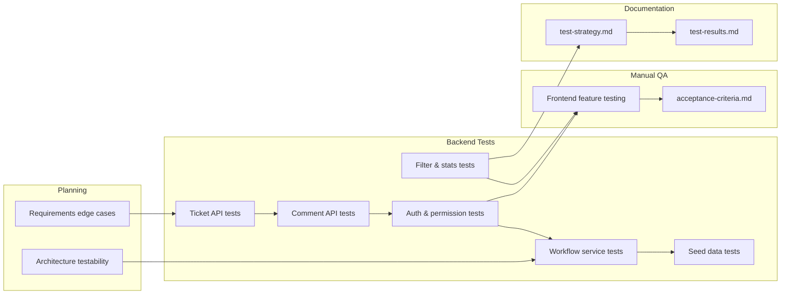

# Testing

**Project:** Support Ticket Management System  
**Author:** Gajender Singh  
**Related:** `test-strategy.md` (detailed approach), `test-results.md` (run results), `acceptance-criteria.md` (manual QA checklists)

This document summarizes the **testing prompts** used during development and the **testing approach** adopted for the project — what was automated, what was verified manually, and how tests were introduced alongside features.

---

## Testing Approach

Testing followed a layered strategy: **automate business rules and API contracts on the backend**, **verify the React UI manually**, and **document both** so regressions are easy to catch.

| Layer | Method | Coverage |
|-------|--------|----------|
| **Service layer** | Django unit tests | Workflow transitions, timestamp side effects |
| **API layer** | Django view/integration tests | CRUD, permissions, filters, stats |
| **Management commands** | Django command tests | Seed data creation and `--clear` |
| **Frontend UI** | Manual QA | All pages, roles, responsive layout |
| **End-to-end** | Manual walkthroughs | Login → create → comment → workflow → dashboard |

### Core Principles

1. **Test with each feature** — backend tests were added when Ticket API, Comment API, auth, workflow, filters, and seed data were implemented; not deferred to the end.
2. **Test business logic at the lowest layer** — workflow rules live in `tickets/services/workflow.py` and are covered by `test_workflow.py` before API integration tests.
3. **Test permissions at the API boundary** — role-based access (customer vs agent) verified through HTTP-level tests with `force_authenticate`.
4. **Use realistic data** — `python manage.py seed_data` supports repeatable manual and integration scenarios.
5. **Fail fast** — run `python manage.py test` after backend changes; walk `acceptance-criteria.md` after frontend changes.
6. **Document gaps honestly** — pagination, category filter, and frontend automation are known gaps (see `test-results.md`).

### Verification Workflow

```
Implement feature
    → Write/update backend tests (if applicable)
    → Run python manage.py test
    → Manual QA against acceptance-criteria.md (frontend)
    → Record results in test-results.md (submission phase)
```

---

## Testing Prompts — Implementation Phase

These prompts drove test creation during backend and frontend development. Tests were not a separate phase; they were requested or generated as part of each feature step.

### 1. Requirements & Edge Cases (Planning)

**Prompt summary:**

> Before writing any code, break down requirements. Explain features, business rules, edge cases, and anything easy to miss.

**Testing impact:**
- Identified permission boundaries, status transition rules, pagination, and empty states early
- Informed later automated permission and workflow tests
- No code generated at this stage

---

### 2. Architecture — Testability (Planning)

**Prompt summary:**

> Design the application architecture. Explain where validation should happen, where business logic should live, and how the project should scale.

**Testing impact:**
- Decision: workflow logic in a **service layer** (testable independently of views)
- Decision: permissions at the **API boundary**
- Decision: validation in **serializers** (testable via API requests expecting `400`)

---

### 3. Ticket API Tests (With Ticket API Implementation)

**Prompt summary:**

> Implement the Ticket API: list, retrieve, create, update, delete. Use existing serializers. Focus only on the Ticket API.

**Tests delivered** (`backend/tickets/tests.py`):
- `test_create_ticket`, `test_retrieve_ticket`, `test_update_ticket`
- `test_list_tickets_requires_authentication`
- Initial CRUD coverage with `APIRequestFactory` + `force_authenticate`

**Approach:** View-level tests calling `TicketListCreateView` and `TicketDetailView` directly (no URL routing required at this step).

---

### 4. Comment API Tests (With Comment API Implementation)

**Prompt summary:**

> Implement the Comment API: list, retrieve, create, update, delete. Focus only on the Comment API.

**Tests delivered** (`backend/comments/tests.py`):
- `test_create_comment`, `test_retrieve_comment`, `test_update_comment`, `test_delete_comment`
- CRUD coverage before permissions were added

---

### 5. Authentication & Permission Tests (With Auth Implementation)

**Prompt summary:**

> Implement authentication and permissions for Ticket and Comment APIs. Don't implement frontend login yet.

**Tests delivered/updated:**
- `backend/accounts/tests.py` — register, login, `/api/auth/me/` (4 tests, `APITestCase`)
- `backend/tickets/tests.py` — role scoping, delete restrictions, 404 on unauthorized access
- `backend/comments/tests.py` — internal note visibility, cross-ticket access denied

**Key scenarios automated:**
- Customer sees only own tickets; agent sees all
- Customer cannot delete tickets; agent can
- Customer cannot see or create internal comments
- Unauthorized ticket access returns **404** (not 403)

---

### 6. Workflow Tests (Explicit Testing Prompt)

**Prompt summary:**

> Implement ticket status workflow. Before generating code, explain:
> 1. Valid status transitions and disallowed transitions
> 2. Where business logic should live (model vs serializer vs view vs service)
> 3. How invalid transitions should be handled
> 4. **How this logic can be tested**
>
> Then implement. No frontend changes.

**Tests delivered:**
- `backend/tickets/test_workflow.py` — 10 service-layer tests
  - Valid agent transitions (open → in progress, etc.)
  - Invalid transitions (`WorkflowError`)
  - Timestamp side effects (`resolved_at`, `closed_at`, cleared on reopen)
  - Customer-only reopen path
- `backend/tickets/tests.py` — 2 API-layer tests
  - `test_invalid_status_transition_returns_400`
  - `test_valid_status_transition_updates_ticket`

**Approach:** Service tests run without HTTP; API tests confirm serializer integration.

---

### 7. Seed Data Tests (With Seed Command)

**Prompt summary:**

> Create seed data: users with roles, tickets in all statuses, comments. Focus only on seed data.

**Tests delivered** (`backend/tickets/test_seed_data.py`):
- `test_seed_data_creates_sample_records`
- `test_seed_data_clear_recreates_records`

**Approach:** `call_command("seed_data")` with `StringIO` stdout; assert record counts and key records exist.

---

### 8. Filter & Search Tests (With Search/Filter Feature)

**Prompt summary:**

> Improve the Ticket List page with search and filtering. Include pagination. Don't implement dashboard yet.

**Tests delivered** (added to `backend/tickets/tests.py`):
- `test_filter_tickets_by_status`
- `test_filter_tickets_by_priority`
- `test_search_tickets_by_title`
- `test_ticket_stats_for_customer`
- `test_ticket_stats_for_agent`

**Approach:** Backend filter tests added alongside `TicketFilter` and stats API; pagination verified manually only.

---

### 9. Frontend — No Automated Test Prompts

Frontend features (login, ticket list, detail, comments, create/edit, workflow UI, dashboard) were implemented **without** prompts requesting Vitest, Jest, or Playwright tests.

**Manual verification instead:**
- `npm run build` after frontend changes
- Browser testing with seed users (`customer_alice`, `agent_sarah`, `admin_diana` / `password123`)
- Responsive checks at desktop and mobile widths

---

## Testing Prompts — Documentation Phase

These prompts created the testing documentation suite used for submission and ongoing QA.

### 10. Acceptance Criteria

**Prompt summary:**

> Generate `acceptance-criteria.md`. Create acceptance criteria for every implemented feature: Login, Registration, Ticket List, Ticket Details, Create Ticket, Edit Ticket, Comments, Ticket Workflow, Search, Filters, Pagination. Use a checklist format.

**Deliverable:** `acceptance-criteria.md` — manual QA checklists for all 11 feature areas.

**Role:** Primary manual testing guide for frontend and end-to-end flows.

---

### 11. Test Strategy

**Prompt summary:**

> Generate `test-strategy.md`. Explain: backend testing, frontend testing, manual testing, authentication testing, workflow testing, API testing, edge cases, validation testing.

**Deliverable:** `test-strategy.md` — comprehensive testing approach, tools, patterns, matrices, and coverage gaps.

**Role:** Reference for how each area of the application should be tested.

---

### 12. Test Results

**Prompt summary:**

> Generate `test-results.md`. Summarize completed tests. Include: Authentication, CRUD, Comments, Workflow, Search, Filters, Pagination, Overall result. Present as tables.

**Deliverable:** `test-results.md` — 42/42 PASS from live `python manage.py test` run (July 29, 2026).

**Role:** Evidence of automated test execution and pass status.

---

## Testing Prompt Summary

| # | Phase | Prompt Focus | Tests / Docs Produced |
|---|-------|--------------|----------------------|
| 1 | Planning | Requirements & edge cases | Test scenarios identified |
| 2 | Planning | Architecture & testability | Service layer, API boundary decisions |
| 3 | Implementation | Ticket API | `tickets/tests.py` — CRUD |
| 4 | Implementation | Comment API | `comments/tests.py` — CRUD |
| 5 | Implementation | Auth & permissions | `accounts/tests.py` + permission tests |
| 6 | Implementation | Workflow (+ how to test) | `test_workflow.py` + API workflow tests |
| 7 | Implementation | Seed data | `test_seed_data.py` |
| 8 | Implementation | Search, filters, stats | Filter/search/stats tests |
| 9 | Implementation | Frontend features | Manual QA only |
| 10 | Documentation | Acceptance criteria | `acceptance-criteria.md` |
| 11 | Documentation | Test strategy | `test-strategy.md` |
| 12 | Documentation | Test results | `test-results.md` |

---

## Test Suite Overview

### Automated Backend Tests — 42 Total

| File | Tests | Focus |
|------|-------|-------|
| `backend/accounts/tests.py` | 4 | Register, login, profile |
| `backend/tickets/tests.py` | 16 | CRUD, permissions, filters, search, stats |
| `backend/tickets/test_workflow.py` | 10 | Status transition service |
| `backend/tickets/test_seed_data.py` | 2 | Seed management command |
| `backend/comments/tests.py` | 10 | CRUD, internal notes, permissions |

### Run Commands

```bash
cd backend
source ../venv/bin/activate
python manage.py test                  # all 42 tests
python manage.py test accounts         # auth only
python manage.py test tickets          # tickets + workflow + seed
python manage.py test comments         # comments only
python manage.py test tickets.test_workflow  # workflow service only
```

### Test Patterns Used

| Pattern | Used For | Example |
|---------|----------|---------|
| `APIRequestFactory` + `force_authenticate` | Ticket and comment views | Direct view calls without URL routing |
| `APITestCase` + `reverse()` | Auth endpoints | Full HTTP round-trip |
| Service-layer unit tests | Workflow | `transition()` with `assertRaises(WorkflowError)` |
| `call_command` tests | Seed data | Assert `Ticket.objects.count()` after seed |

### Isolated Test Data

Each test class creates its own users and tickets in `setUp()`. Django wraps each test in a transaction that rolls back — no shared state between tests.

---

## Manual Testing Approach

Manual testing covers everything automated tests do not — especially the React UI, responsive layout, and cross-page user journeys.

### Setup

```bash
# Terminal 1 — Backend
cd backend && source ../venv/bin/activate
python manage.py migrate
python manage.py seed_data
python manage.py runserver

# Terminal 2 — Frontend
cd frontend && npm run dev
```

Open `http://localhost:5173`.

### Manual Test Matrix

| Area | Customer (`customer_alice`) | Agent (`agent_sarah`) |
|------|----------------------------|----------------------|
| Login / logout | ✓ | ✓ |
| Register | ✓ | — |
| Ticket list (scoped) | Own tickets only | All tickets |
| Search, filters, pagination | ✓ | ✓ |
| Create / edit ticket | ✓ | ✓ |
| Comments | ✓ | ✓ |
| Internal comments | Hidden | Visible + creatable |
| Status workflow | Reopen only | Full transitions |
| Dashboard | Customer metrics | Agent metrics |
| Responsive layout | Mobile + desktop | Mobile + desktop |

**Password for all seed users:** `password123`

### Manual Test Procedure

1. Walk through each page in `ui-flow.md`.
2. Check every item in `acceptance-criteria.md`.
3. Test at two viewport widths (desktop ≥1024px, mobile ≤480px).
4. Test with at least two roles (customer and agent).
5. Record failures with steps to reproduce.

---

## Coverage by Category

| Category | Automated | Manual | Result |
|----------|-----------|--------|--------|
| Authentication | 6 tests | ✓ | **PASS** |
| Ticket CRUD | 8 tests | ✓ | **PASS** |
| Comments | 9 tests | ✓ | **PASS** |
| Workflow | 12 tests | ✓ | **PASS** |
| Search | 1 test | ✓ | **PASS** |
| Filters | 2 tests | ✓ | **PASS** |
| Pagination | — | ✓ | **Not automated** |
| Seed data | 2 tests | — | **PASS** |
| Frontend UI | — | ✓ | Manual QA |
| **Total** | **42** | | **42/42 PASS** |

---

## Known Coverage Gaps

| Gap | Status | Recommendation |
|-----|--------|----------------|
| Pagination (`?page=2`) | Manual only | Add automated pagination test |
| Category filter (`?category=`) | Not tested | Add filter test |
| Description search | Title only tested | Add description search test |
| Ticket PUT (full update) | PATCH only | Add PUT test or document as manual |
| Register validation errors | Manual only | Add duplicate username / short password tests |
| Frontend unit tests | Not implemented | Vitest + React Testing Library |
| E2E tests | Not implemented | Playwright or Cypress |

---

## Testing Timeline



---

## Prompt Template Used (Workflow Example)

The workflow prompt is the clearest example of the **explain → test plan → implement** pattern:

```
[Context: authentication and permissions are complete]

Before generating code, explain:
1. Valid status transitions
2. Where business logic should live
3. How invalid transitions should be handled
4. How this logic can be tested

After the explanation, implement the workflow.
Don't implement frontend changes yet.
```

This pattern ensured tests were designed **before** code was written, not retrofitted afterward.

---

## Related Documents

| Document | Focus |
|----------|-------|
| **`testing.md`** (this file) | Testing prompts and overall approach |
| **`test-strategy.md`** | Detailed backend, manual, API, workflow, validation testing |
| **`test-results.md`** | 42/42 pass results by category (tables) |
| **`acceptance-criteria.md`** | Manual QA checklists per feature |
| **`implementation.md`** | Implementation prompts (includes workflow test prompt) |
| **`planning.md`** | Full project timeline including testing phase |

---

## Document Control

| Field | Value |
|-------|-------|
| **Project** | Support Ticket Management System |
| **Author** | Gajender Singh |
| **Automated Tests** | 42 (backend only) |
| **Testing Prompts** | 12 (8 implementation + 3 documentation + 1 planning) |
| **Last Test Run** | July 29, 2026 — 42/42 PASS |
| **Status** | Backend automated; frontend manual |
