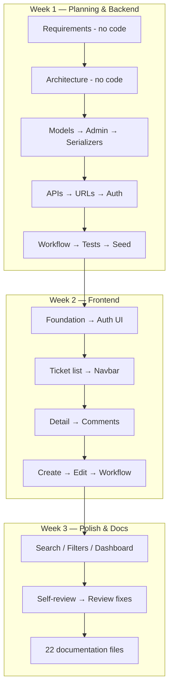

# Cursor Workflow

**Project:** Support Ticket Management System  
**Author:** Gajender Singh  
**Tool:** Cursor AI  
**Related:** `final-ai-usage-summary.md`, `planning.md`, `implementation.md`

This document describes **how Cursor AI was used throughout the project** — the iterative workflow followed, and the role AI played in planning, code generation, review, refactoring, testing, and documentation.

---

## Overview

Cursor AI was used as an **assistive development tool**, not an autonomous builder. The project was **not** generated in a single prompt. Instead, work progressed through **dozens of focused prompts** across three weeks, each with a narrow scope, explicit exclusions, and verification before moving on.

| Phase | Cursor AI Role | Developer Role |
|-------|----------------|----------------|
| **Planning** | Suggested architecture, phasing, trade-offs | Defined scope, roles, workflow rules, delivery order |
| **Code generation** | Produced models, APIs, components, CSS, tests | Reviewed diffs, ran tests/builds, fixed issues |
| **Code review** | Drafted self-review findings and gap analysis | Validated honestly against the codebase |
| **Refactoring** | Proposed extractions (service layer, shared querysets) | Approved scope, verified behavior unchanged |
| **Testing** | Drafted test cases, test docs, gap identification | Ran `manage.py test`, manual QA, captured real results |
| **Documentation** | Drafted 22 markdown files from structured prompts | Verified every doc against actual implementation |

**Human verification was mandatory:** backend changes validated with 42 automated tests; frontend changes with `npm run build` and manual walkthroughs against `acceptance-criteria.md`.

---

## Why Not One Prompt?

Generating the entire project in one prompt was intentionally avoided.

| One-shot approach | Problems |
|-------------------|----------|
| "Build a full ticket system" | Overwhelming output; hard to review |
| No scope boundaries | Frontend and backend mixed; incomplete edges |
| No verification gates | Bugs compound silently |
| No learning | Decisions made by AI, not understood |

| Iterative approach | Benefits |
|--------------------|----------|
| One feature per prompt | Small, reviewable diffs |
| Explicit exclusions ("don't build X yet") | Prevents premature dependencies |
| Explain → implement → verify | Understanding before code |
| Backend before frontend | API contract stable before UI |
| Tests with each backend step | Regressions caught early |

### The Core Loop

Every significant step followed the same cycle:

```
┌─────────────┐
│   Context   │  "X is complete. Now implement Y."
└──────┬──────┘
       ▼
┌─────────────┐
│  Explain    │  "Explain design before generating code."
└──────┬──────┘
       ▼
┌─────────────┐
│  Generate   │  "Focus only on Y. Don't build Z yet."
└──────┬──────┘
       ▼
┌─────────────┐
│   Verify    │  migrate / test / build / manual check
└──────┬──────┘
       ▼
     Next step
```

**Example progression (backend):**

```
Requirements (no code)
  → Architecture (no code)
  → Ticket model only
  → Comment model only
  → Admin only
  → Serializers only
  → Ticket API only
  → Comment API only
  → URLs only
  → Auth & permissions only
  → Workflow only
  → Seed data only
```

**Example progression (frontend):**

```
Architecture plan (no code)
  → Foundation (proxy, client, auth context, routes)
  → Login / Register only
  → Ticket list only
  → Navbar (after "how do I log out?")
  → Ticket detail only
  → Comments only
  → Create ticket only
  → Edit ticket only
  → Status workflow only
  → Search & filters only
  → Dashboard last
```

---

## Planning

### How Cursor Was Used

Early prompts explicitly said **"Don't generate code yet."** Cursor helped break down requirements, compare architectural options, and recommend a phased delivery order before any implementation began.

### Typical Planning Prompts

| Prompt | Outcome |
|--------|---------|
| Break down requirements, business rules, edge cases | MVP scope, roles, workflow lifecycle |
| Design architecture (folder structure, API flow, where logic lives) | Three Django apps, service layer, token auth |
| Design API layer (endpoints, HTTP methods, ViewSet trade-offs) | Generic class-based views, REST prefixes |
| Plan frontend (pages, components, auth approach) | Route map, `api/` layer, React Context |

### Key Planning Decisions (Human-Led)

- Three roles: **customer**, **agent**, **admin**
- Ticket workflow with reopen support
- **404** (not 403) for unauthorized ticket access
- Dashboard deferred until core ticket features were complete
- Categories: IT Support, Access, Admin Issue, HR

### Cursor Output vs Human Input

| Cursor suggested | Developer decided |
|------------------|-------------------|
| Decoupled SPA + REST API | Final stack and app boundaries |
| ViewSets + routers | Generic API views for explicit URLs |
| JWT or session auth | Token auth for SPA simplicity |
| Feature phasing order | When to build dashboard, filters |

**Documented in:** `planning.md`, `requirements-analysis.md`, `design-notes.md`

---

## Code Generation

### How Cursor Was Used

Cursor generated the majority of implementation code — Django models, DRF serializers and views, permission classes, workflow service, React components, CSS, and API client modules. Each generation prompt scoped **one deliverable** and named **what to exclude**.

### Prompt Pattern

```
[Context: what is already complete]

Now I'd like to implement [FEATURE].

Generate:
- [deliverable 1]
- [deliverable 2]

Let's focus only on [SCOPE].
Don't implement [EXCLUSIONS] yet.
```

### Backend Generation (14 steps)

| Step | Generated | Excluded |
|------|-----------|----------|
| Ticket model | `models.py`, migration | Serializers, views, APIs |
| Comment model | `models.py`, migration | APIs |
| Django Admin | `admin.py` for both apps | Serializers, views |
| Serializers | Ticket + Comment serializers | Views, URLs |
| Ticket API | List/create + detail views | Comment API, URLs |
| Comment API | List/create + detail views | URLs, auth |
| URL routing | App + project `urls.py` | Auth |
| Auth & permissions | `accounts` app, token auth | Frontend |
| Workflow | `services/workflow.py` | Frontend |
| Seed data | `seed_data` command | Frontend |
| Filters & stats | `TicketFilter`, stats API | Dashboard UI |

### Frontend Generation (11 steps)

| Step | Generated | Excluded |
|------|-----------|----------|
| Foundation | Vite proxy, `apiClient`, `AuthContext`, routes | Pages, components |
| Auth UI | Login, Register forms | Layout, tickets |
| Ticket list | `TicketListPage`, cards, badges | Detail, create |
| Navbar | `Navbar`, `AppLayout`, logout | — |
| Ticket detail | `TicketDetailPage`, `TicketMeta` | Comments, workflow |
| Comments | `CommentList`, `CommentForm` | Edit/delete |
| Create ticket | `CreateTicketPage`, `TicketForm` | Edit mode |
| Edit ticket | `EditTicketPage`, form reuse | Workflow |
| Status workflow | `TicketStatusActions`, notifications | Filters, dashboard |
| Search & filters | `TicketFilters`, pagination | Dashboard |
| Dashboard | `DashboardPage`, stats integration | — |

### Review After Every Generation

After each Cursor generation:

1. **Read the diff** — understand what changed
2. **Run backend tests** — `python manage.py test`
3. **Run frontend build** — `npm run build`
4. **Manual smoke test** — login, key page, new feature
5. **Fix before continuing** — never stack unverified changes

**Documented in:** `implementation.md`

---

## Code Review

### How Cursor Was Used

After the core build was complete, Cursor generated a structured **self-review** (`code-review-notes.md`) covering strengths, organization, security, performance, and improvement areas. This was not a substitute for human judgment — it was a starting point for honest assessment.

### Review Prompt

> Generate `code-review-notes.md`. Review the project and identify: Strengths, Code organization, Maintainability, Reusability, Security, Performance, Possible improvements.

### What the Review Surfaced

| Area | Finding |
|------|---------|
| **Strengths** | Clear app separation, service layer, 42 backend tests, comprehensive docs |
| **Security** | 404 for unauthorized access, token auth, permission classes |
| **Gaps** | No `requirements.txt`, no frontend tests, no CORS (proxy only) |
| **Performance** | `select_related`, indexes, list serializer omits description |
| **Maintainability** | Workflow maps duplicated on frontend and backend |

### Human Follow-Up

The developer used review findings to drive a second implementation pass documented in `review-fixes.md`:

- Search, filters, and pagination on ticket list
- Dashboard with stats API
- Client-side validation aligned with serializers
- Centralized error parsing (`getApiErrorMessage`)
- Shared `get_scoped_ticket_queryset()` helper

**Documented in:** `code-review-notes.md`, `review-fixes.md`

---

## Refactoring

### How Cursor Was Used

Refactoring happened **during feature work and after review**, not as a separate big-bang rewrite. Cursor proposed extractions when new features exposed duplication.

### Refactoring Prompts (Implicit)

Refactoring was often triggered by feature prompts that required cleaner structure:

| Trigger | Refactoring |
|---------|-------------|
| Search & filters | Extract `TicketFilter`, add `django-filter` |
| Dashboard | Extract `build_ticket_stats()` service, `TicketStatsView` |
| Role scoping in multiple views | Extract `get_scoped_ticket_queryset()` |
| Create + edit ticket pages | Reuse single `TicketForm` with `mode` prop |
| Error handling across forms | Extract `utils/errors.js` |
| Filter state on list page | Export `EMPTY_FILTERS`, `hasActiveFilters()` |

### Example: View Bug During Refactor

While refactoring `tickets/views.py` for filters and dashboard, a partial edit accidentally merged `get_serializer_class()` into `get_queryset()`. Cursor diagnosed and restored the correct method separation after tests failed.

### Refactoring Principles Applied

1. **Smallest change** — extract only when duplication appears twice or more
2. **Tests as safety net** — run full suite after each refactor
3. **No style-only refactors** — every change tied to a feature or review finding
4. **Service layer for business logic** — workflow and stats out of views

**Documented in:** `review-fixes.md`, `debugging.md`

---

## Testing

### How Cursor Was Used

Testing was **continuous**, not a final phase. Cursor generated test files alongside API implementations and later drafted testing documentation from real test output.

### Test Generation During Implementation

| When | What Cursor generated |
|------|----------------------|
| Ticket API | `tickets/tests.py` — CRUD, auth guard |
| Comment API | `comments/tests.py` — CRUD |
| Auth | `accounts/tests.py` — register, login, me |
| Workflow prompt ("how can this be tested?") | `test_workflow.py` — 10 service tests |
| Seed data | `test_seed_data.py` |
| Filters & stats | Search, filter, stats tests |

### Test Documentation Prompts

| Prompt | Deliverable |
|--------|-------------|
| Generate `test-strategy.md` | Full testing approach, gaps, matrices |
| Generate `test-results.md` | 42/42 PASS from live test run (tables) |

### Verification Workflow

```bash
# After every backend change
cd backend && python manage.py test

# After documentation claiming test results
python manage.py test --verbosity=2   # capture for test-results.md

# Frontend (no automation)
# Walk acceptance-criteria.md with seed users
```

### Human Role in Testing

- Ran tests and confirmed output was real (not assumed)
- Performed manual QA for all UI flows (customer + agent)
- Documented gaps honestly: no pagination test, no frontend automation
- Fixed failing tests (401 vs 403 assertion, seed `--clear` expectation)

**Documented in:** `testing.md`, `test-strategy.md`, `test-results.md`

---

## Documentation

### How Cursor Was Used

Documentation was generated in a **dedicated submission phase** (July 29, 2026) after the application was feature-complete. Twenty-two markdown files were produced from structured single-file prompts, each reviewed against the actual codebase.

### Documentation Approach

| Principle | Application |
|-----------|-------------|
| One prompt → one file | "Generate only README.md" |
| Structured sections | Prompts listed required headings |
| Implementation-specific | "Base everything on this project only" |
| Real evidence | `test-results.md` from actual test run |

### Documentation Batches

**Submission package (16 files):** README, candidate info, requirements, acceptance criteria, implementation plan, design notes, API contract, data model, UI flow, test strategy/results, code review, review fixes, PR description, reflection, AI usage summary.

**Process documentation (6 files):** planning, design, implementation, testing, debugging, documentation prompts.

### Human Review of Docs

Every generated document was cross-checked:

- README commands run successfully
- API contract matches `urls.py` and serializers
- Data model matches `models.py` and migrations
- Acceptance criteria match browser behavior
- No features described that were not built

**Documented in:** `documentation.md`, `final-ai-usage-summary.md`

---

## Iterative Workflow Timeline



---

## Session Patterns in Cursor

### Effective Prompt Habits

| Habit | Why it worked |
|-------|---------------|
| State what's done first | Gives Cursor accurate context |
| List explicit exclusions | Prevents scope creep |
| Ask for explanation before code | Catches design issues early |
| One file/feature per turn | Reviewable output |
| Ask follow-up questions | "How do I log out?" → Navbar built |
| Run commands in Cursor | Tests and builds verify immediately |

### Questions That Improved the Project

| Question | Result |
|----------|--------|
| Why multiple classes inside Ticket? | Understood `TextChoices` pattern |
| Will Django login work in React? | Clarified token vs session auth |
| How can I log out? | Navbar with profile dropdown |
| Can you migrate these fields? | Confirmed migration state |
| How can workflow logic be tested? | Dedicated `test_workflow.py` |

### Issues Caught During Review

| Issue | How caught |
|-------|------------|
| `get_serializer_class` merged into `get_queryset` | Failing ticket tests |
| Missing `apiClient` import | `npm run build` failure |
| DRF not in `INSTALLED_APPS` | Import/config error |
| `django-filter` not installed | Filter feature setup |
| Docs describing unbuilt features | Manual doc review |

---

## Comparison: One Prompt vs This Workflow

| Dimension | Single prompt | Iterative Cursor workflow |
|-----------|---------------|---------------------------|
| **Reviewability** | Thousands of lines at once | 50–200 lines per step |
| **Understanding** | Copy-paste without learning | Explain-first builds knowledge |
| **Test coverage** | Often missing or broken | Tests added with each API |
| **Dependencies** | Wrong order (UI before API) | Backend → frontend enforced |
| **Debugging** | Hard to isolate regressions | Failures tied to last small change |
| **Documentation** | Generic or inaccurate | Generated from finished, verified code |
| **Git history** | One commit or messy | 9 meaningful commits |
| **Human ownership** | Unclear what developer knows | Developer verified every step |

---

## Metrics

| Metric | Value |
|--------|-------|
| Development period | ~3 weeks (Jul 21 – Jul 29, 2026) |
| Implementation prompts | ~25 (backend 14 + frontend 11) |
| Documentation prompts | 22 |
| Git commits | 9 |
| Backend automated tests | 42 (all passing) |
| Frontend automated tests | 0 (manual QA) |
| Django apps | 3 (`accounts`, `tickets`, `comments`) |
| API endpoints | 16 |
| Frontend pages | 7 |

---

## Statement of Responsibility

Cursor AI accelerated development, but **the developer remained responsible for**:

- Architecture and business rule decisions
- Reviewing every generated diff before acceptance
- Running tests and builds after each change
- Manual QA of all frontend flows
- Verifying documentation against the real codebase
- Documenting known gaps honestly

AI was a **pair programmer and draft generator** — not the author of record.

---

## Related Documents

| Document | Focus |
|----------|-------|
| **`cursor-workflow.md`** (this file) | How Cursor was used; iterative workflow |
| **`final-ai-usage-summary.md`** | AI disclosure and responsibility statement |
| **`planning.md`** | Planning prompts and decisions |
| **`implementation.md`** | Implementation prompts (backend + frontend) |
| **`testing.md`** | Testing prompts and approach |
| **`debugging.md`** | Issues resolved during development |
| **`documentation.md`** | Documentation generation prompts |
| **`reflection.md`** | First-person lessons learned |

---

## Document Control

| Field | Value |
|-------|-------|
| **Project** | Support Ticket Management System |
| **Author** | Gajender Singh |
| **AI Tool** | Cursor AI |
| **Workflow** | Iterative (explain → generate → verify) |
| **Status** | Complete |
