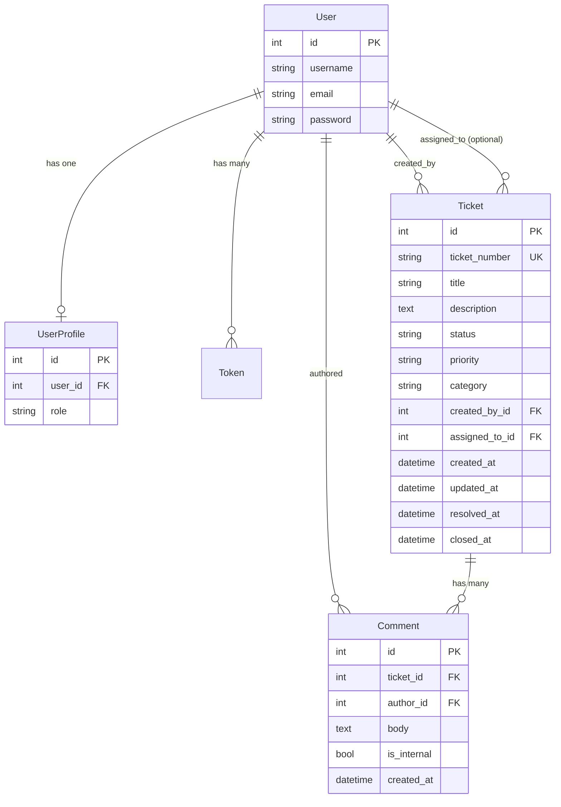

# Data Model

**Project:** Support Ticket Management System  
**Database:** SQLite (`backend/db.sqlite3`)  
**ORM:** Django 4.2

This document describes the implemented database schema, relationships, and business rules enforced at the model and application layers.

---

## Entity Relationship Overview



---

## User

The application uses Django's built-in **`auth_user`** table (`django.contrib.auth.models.User`) for authentication credentials. Application roles are stored separately in **`accounts_userprofile`**.

### `auth_user` (Django built-in)

| Field | Type | Constraints | Description |
|-------|------|-------------|-------------|
| `id` | `BigAutoField` | PK | Surrogate primary key |
| `username` | `varchar(150)` | Unique, required | Login identifier |
| `email` | `varchar(254)` | Optional | User email address |
| `password` | `varchar(128)` | Required | Hashed password (Django `PBKDF2`) |
| `first_name` | `varchar(150)` | Optional | Not used by the API |
| `last_name` | `varchar(150)` | Optional | Not used by the API |
| `is_active` | `boolean` | Default `true` | Account active flag |
| `is_staff` | `boolean` | Default `false` | Django admin access |
| `is_superuser` | `boolean` | Default `false` | Treated as **admin** role in app logic |
| `date_joined` | `datetime` | Auto-set | Account creation timestamp |
| `last_login` | `datetime` | Nullable | Last successful login |

**Model file:** Django built-in (`django.contrib.auth`)  
**API exposure:** `id`, `username`, `email`, and `role` (from profile) via `UserSerializer`

### `accounts_userprofile`

| Field | Type | Constraints | Description |
|-------|------|-------------|-------------|
| `id` | `BigAutoField` | PK | Surrogate primary key |
| `user_id` | `OneToOneField → auth_user` | FK, `CASCADE`, `related_name="profile"` | Links profile to user |
| `role` | `varchar(20)` | Choices, default `customer` | Application role |

**Role choices:**

| DB Value | Display | Description |
|----------|---------|-------------|
| `customer` | Customer | Default role; can manage own tickets |
| `agent` | Agent | Can manage all tickets and internal comments |
| `admin` | Admin | Same permissions as agent in the API |

**Model file:** `backend/accounts/models.py` — `UserProfile`

### Auto-creation signal

A `post_save` signal on `User` automatically creates a `UserProfile` with role `customer` when a new user is registered:

```python
# backend/accounts/signals.py
@receiver(post_save, sender=User)
def create_user_profile(sender, instance, created, **kwargs):
    if created:
        UserProfile.objects.create(user=instance)
```

### `authtoken_token` (DRF built-in)

| Field | Type | Constraints | Description |
|-------|------|-------------|-------------|
| `key` | `varchar(40)` | PK | Authentication token string |
| `user_id` | `OneToOneField → auth_user` | FK, `CASCADE` | Token owner |
| `created` | `datetime` | Auto-set | Token creation time |

Issued on register/login; sent as `Authorization: Token <key>`.

---

## Ticket

**Table:** `tickets_ticket`  
**Model file:** `backend/tickets/models.py` — `Ticket`  
**Default ordering:** `-created_at` (newest first)

| Field | Type | Constraints | Description |
|-------|------|-------------|-------------|
| `id` | `BigAutoField` | PK | Surrogate primary key |
| `ticket_number` | `varchar(20)` | Unique, not editable | Human-readable ID (e.g. `TKT-00001`) |
| `title` | `varchar(200)` | Required | Short summary of the issue |
| `description` | `TextField` | Required | Full problem description |
| `status` | `varchar(30)` | Choices, indexed, default `open` | Current workflow state |
| `priority` | `varchar(10)` | Choices, indexed, default `medium` | Urgency level |
| `category` | `varchar(20)` | Choices, indexed, default `it_support` | Request type |
| `created_by_id` | `ForeignKey → auth_user` | `PROTECT`, `related_name="tickets_created"` | User who submitted the ticket |
| `assigned_to_id` | `ForeignKey → auth_user` | `SET_NULL`, nullable, `related_name="tickets_assigned"` | Agent assigned to the ticket |
| `created_at` | `DateTimeField` | `auto_now_add`, indexed | Record creation time (UTC) |
| `updated_at` | `DateTimeField` | `auto_now` | Last modification time (UTC) |
| `resolved_at` | `DateTimeField` | Nullable | Set when status becomes `resolved` |
| `closed_at` | `DateTimeField` | Nullable | Set when status becomes `closed` |

### Status choices

| DB Value | Display |
|----------|---------|
| `open` | Open |
| `in_progress` | In Progress |
| `waiting_on_customer` | Waiting on Customer |
| `resolved` | Resolved |
| `reopened` | Reopened |
| `closed` | Closed |

### Priority choices

| DB Value | Display |
|----------|---------|
| `low` | Low |
| `medium` | Medium |
| `high` | High |
| `urgent` | Urgent |

### Category choices

| DB Value | Display |
|----------|---------|
| `it_support` | IT Support |
| `access` | Access |
| `admin_issue` | Admin Issue |
| `hr` | HR |

> **Migration note:** Categories were updated in migration `0002_alter_ticket_category` from `billing`, `technical`, `account`, `general` to the current IT-support-focused set.

### Indexes

| Index | Fields | Purpose |
|-------|--------|---------|
| Single-column | `status`, `priority`, `category`, `created_at` | Filter and sort on list API |
| Composite | `(status, priority)` | Combined status/priority queries |
| Composite | `(assigned_to, status)` | Agent workload and unassigned queue |

### Ticket number generation

Assigned in `Ticket.save()` before the first insert:

```python
next_id = (last_ticket_id or 0) + 1
ticket_number = f"TKT-{next_id:05d}"  # e.g. TKT-00001
```

The number is based on the highest existing `id`, not a separate sequence table.

---

## Comment

**Table:** `comments_comment`  
**Model file:** `backend/comments/models.py` — `Comment`  
**Default ordering:** `created_at` (oldest first — chronological thread)

| Field | Type | Constraints | Description |
|-------|------|-------------|-------------|
| `id` | `BigAutoField` | PK | Surrogate primary key |
| `ticket_id` | `ForeignKey → tickets_ticket` | `CASCADE`, `related_name="comments"` | Parent ticket |
| `author_id` | `ForeignKey → auth_user` | `PROTECT`, `related_name="comments"` | User who wrote the comment |
| `body` | `TextField` | Required | Comment text |
| `is_internal` | `BooleanField` | Default `false` | Agent-only note; hidden from customers |
| `created_at` | `DateTimeField` | `auto_now_add`, indexed | Comment creation time (UTC) |

### Indexes

| Index | Fields | Purpose |
|-------|--------|---------|
| Single-column | `created_at` | Chronological ordering |
| Composite | `(ticket, created_at)` | Efficient per-ticket thread loading |

---

## Relationships

### Summary Table

| From | To | Cardinality | FK Field | On Delete | Related Name |
|------|----|-------------|----------|-----------|--------------|
| `UserProfile` | `User` | 1:1 | `user_id` | `CASCADE` | `profile` |
| `Token` | `User` | 1:1 | `user_id` | `CASCADE` | — |
| `Ticket` | `User` (creator) | N:1 | `created_by_id` | `PROTECT` | `tickets_created` |
| `Ticket` | `User` (assignee) | N:1 (optional) | `assigned_to_id` | `SET_NULL` | `tickets_assigned` |
| `Comment` | `Ticket` | N:1 | `ticket_id` | `CASCADE` | `comments` |
| `Comment` | `User` (author) | N:1 | `author_id` | `PROTECT` | `comments` |

### Relationship Diagram (Text)

```
User (auth_user)
 ├── profile          → UserProfile (1:1)
 ├── auth_token       → Token (1:1)
 ├── tickets_created  → Ticket[] (1:N, required)
 ├── tickets_assigned → Ticket[] (1:N, optional)
 └── comments         → Comment[] (1:N)

Ticket
 └── comments         → Comment[] (1:N, cascade delete)
```

### Delete Behavior

| Action | Effect |
|--------|--------|
| Delete `User` who created tickets | **Blocked** — `PROTECT` on `Ticket.created_by` |
| Delete `User` who authored comments | **Blocked** — `PROTECT` on `Comment.author` |
| Delete `User` assigned to tickets | **Allowed** — `assigned_to` set to `NULL` |
| Delete `User` (with profile) | Profile deleted via `CASCADE` |
| Delete `Ticket` | All related `Comment` rows deleted via `CASCADE` |
| Delete `User` with token | Token deleted via `CASCADE` |

### Reverse Accessors (ORM)

```python
user.profile                          # UserProfile
user.tickets_created.all()            # Tickets created by user
user.tickets_assigned.all()           # Tickets assigned to user
user.comments.all()                   # Comments authored by user
ticket.comments.all()                 # Comment thread on ticket
ticket.created_by                     # Creator User
ticket.assigned_to                    # Assignee User or None
comment.ticket                        # Parent Ticket
comment.author                        # Author User
```

---

## Field Descriptions — Validation Rules

Validation is enforced in serializers (`backend/tickets/serializers.py`, `backend/comments/serializers.py`, `backend/accounts/serializers.py`) in addition to model constraints.

### User (registration)

| Field | API Validation |
|-------|----------------|
| `username` | Required; stripped; non-blank; unique |
| `email` | Optional; valid email format |
| `password` | Required; minimum 8 characters; hashed on save |

### Ticket (create / update)

| Field | API Validation |
|-------|----------------|
| `title` | Required; stripped; non-blank; minimum 5 characters |
| `description` | Required; stripped; non-blank; minimum 10 characters |
| `category` | Optional on create; must be valid choice |
| `priority` | Optional on create; must be valid choice |
| `status` | Writable on update; must pass workflow rules |
| `ticket_number` | Read-only; system-generated |
| `created_by` | Set automatically on create; read-only |
| `resolved_at`, `closed_at` | Read-only; set by workflow service |

### Comment (create / update)

| Field | API Validation |
|-------|----------------|
| `body` | Required; stripped; non-blank; minimum 2 characters |
| `is_internal` | Default `false`; only agents/admins may set `true` |
| `ticket` | Required on create; must be an accessible ticket |
| `author` | Set automatically from authenticated user; read-only |

---

## Business Rules

### User & Role Rules

| Rule | Implementation |
|------|----------------|
| BR-U01 | Every new `User` gets a `UserProfile` with role `customer` via signal |
| BR-U02 | Role is read from `user.profile.role`; superusers are treated as `admin` in `get_user_role()` |
| BR-U03 | Role is not self-assignable through the registration API |
| BR-U04 | Passwords are never stored in plain text |

### Ticket Rules

| Rule | Implementation |
|------|----------------|
| BR-T01 | `ticket_number` is unique and assigned on first save |
| BR-T02 | New tickets default to `status=open`, `priority=medium`, `category=it_support` |
| BR-T03 | `created_by` is always the authenticated user at creation time |
| BR-T04 | `assigned_to` is optional (`null` = unassigned) |
| BR-T05 | Status changes must follow the workflow map in `tickets/services/workflow.py` |
| BR-T06 | Transition to `resolved` sets `resolved_at` to current UTC time |
| BR-T07 | Transition to `closed` sets `closed_at` to current UTC time |
| BR-T08 | Transition to `reopened` clears `resolved_at` and `closed_at` |
| BR-T09 | Customers may only view tickets where `created_by = self` |
| BR-T10 | Agents/admins may view all tickets |
| BR-T11 | Customers cannot delete tickets |
| BR-T12 | Unauthorized ticket access returns HTTP 404 (not 403) |

### Comment Rules

| Rule | Implementation |
|------|----------------|
| BR-C01 | Every comment belongs to exactly one ticket and one author |
| BR-C02 | `is_internal=true` comments are excluded from customer queries |
| BR-C03 | Customers cannot create comments with `is_internal=true` |
| BR-C04 | Customers may only comment on tickets they created |
| BR-C05 | Customers may update/delete only their own non-internal comments |
| BR-C06 | Agents/admins have full CRUD on all comments |
| BR-C07 | Deleting a ticket deletes all its comments (`CASCADE`) |

### Workflow Rules (status transitions)

**Agent / Admin** — defined in `AGENT_TRANSITIONS`:

| Current Status | Allowed Next Statuses |
|----------------|----------------------|
| `open` | `in_progress`, `closed` |
| `in_progress` | `waiting_on_customer`, `resolved`, `closed` |
| `waiting_on_customer` | `in_progress` |
| `resolved` | `closed`, `reopened` |
| `reopened` | `in_progress` |
| `closed` | `reopened` |

**Customer** — defined in `CUSTOMER_TRANSITIONS`:

| Current Status | Allowed Next Status |
|----------------|---------------------|
| `resolved` | `reopened` |
| `closed` | `reopened` |

### Dashboard Metric Rules (derived, not stored)

| Metric | Definition |
|--------|------------|
| `open_pipeline` | Count of tickets in `open`, `in_progress`, `waiting_on_customer`, or `reopened` |
| `unassigned` | Active tickets with `assigned_to IS NULL` |
| `urgent_open` | Active tickets with priority `urgent` or `high` |
| `needs_attention` | Customer tickets in `waiting_on_customer` status |
| `active` | Customer tickets in `open`, `in_progress`, `waiting_on_customer`, or `reopened` |

Computed in `tickets/services/stats.py`; not persisted as columns.

---

## Database Tables Summary

| Table | App | Model Class |
|-------|-----|-------------|
| `auth_user` | `django.contrib.auth` | `User` |
| `authtoken_token` | `rest_framework.authtoken` | `Token` |
| `accounts_userprofile` | `accounts` | `UserProfile` |
| `tickets_ticket` | `tickets` | `Ticket` |
| `comments_comment` | `comments` | `Comment` |

---

## Migrations

| App | Migration | Description |
|-----|-----------|-------------|
| `tickets` | `0001_initial` | Create `Ticket` model |
| `tickets` | `0002_alter_ticket_category` | Update category choices |
| `accounts` | `0001_initial` | Create `UserProfile` model |
| `comments` | `0001_initial` | Create `Comment` model |
| `authtoken` | `0001_initial` … `0004` | DRF token tables (Django built-in) |

Apply with:

```bash
cd backend
python manage.py migrate
```

---

## Document Control

| Field | Value |
|-------|-------|
| **Project** | Support Ticket Management System |
| **Source** | `backend/accounts/models.py`, `backend/tickets/models.py`, `backend/comments/models.py` |
| **Status** | Reflects implemented schema |
