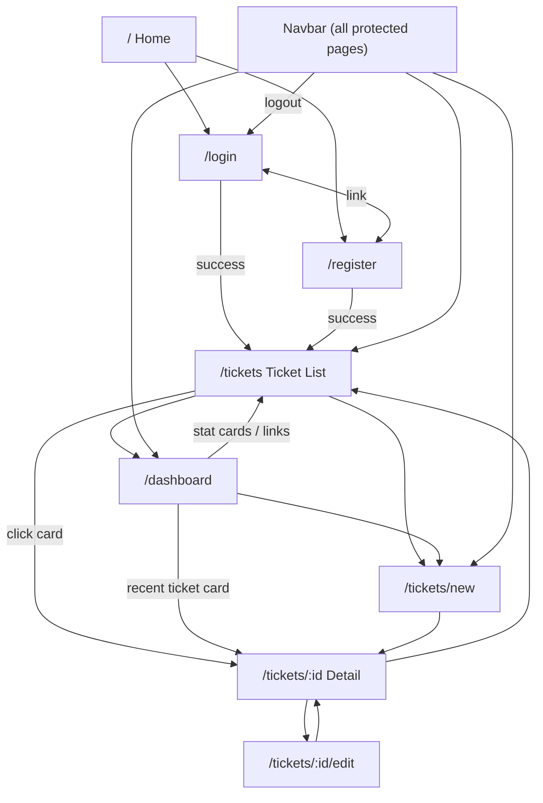

# UI Flow

**Project:** Support Ticket Management System  
**Frontend:** React 19 + React Router 7

This document describes every page in the application, what users see and do on each page, and how navigation works across the app.

---

## Application Structure

### Route Map

| Route | Page | Access |
|-------|------|--------|
| `/` | Home (placeholder) | Public |
| `/login` | Login | Guest only |
| `/register` | Register | Guest only |
| `/dashboard` | Dashboard | Authenticated |
| `/tickets` | Ticket List | Authenticated |
| `/tickets/new` | Create Ticket | Authenticated |
| `/tickets/:id` | Ticket Detail | Authenticated |
| `/tickets/:id/edit` | Edit Ticket | Authenticated |
| `*` (any other) | Redirect to `/` | — |

### Layout Layers

```
Public pages          →  <main> only (no navbar)
Protected pages       →  <AppLayout> = <Navbar> + page content
```

Protected routes are wrapped by two guards:

1. **`ProtectedRoute`** — redirects to `/login` if not authenticated
2. **`GuestRoute`** — redirects to `/tickets` if already authenticated

---

## Navigation Overview



### Post-Login Landing

After a successful **login** or **registration**, users are redirected to **`/tickets`** (Ticket List), not the dashboard.

### Navbar (Authenticated)

Every protected page shows a persistent top navbar with:

| Link | Destination |
|------|-------------|
| Brand logo ("Support Tickets") | `/tickets` |
| Dashboard | `/dashboard` |
| Tickets | `/tickets` |
| Create Ticket | `/tickets/new` |
| Profile dropdown | Username, email, role badge |
| Logout | `/login` (session cleared) |

On mobile, navigation links collapse behind a hamburger toggle.

---

## Page: Home

**Route:** `/`  
**Access:** Public  
**File:** `frontend/src/routes/AppRoutes.jsx` (inline placeholder)

### Purpose

Landing page for unauthenticated visitors.

### Content

- Heading: "Support Ticket System"
- Message: "Log in to manage your support tickets."

### Navigation From Here

- Users must manually navigate to `/login` or `/register` (no links on this placeholder page).
- Unknown URLs redirect to `/`.

---

## Page: Login

**Route:** `/login`  
**Access:** Guest only (authenticated users redirected to `/tickets`)  
**File:** `frontend/src/pages/LoginPage.jsx` → `LoginForm`

### Purpose

Authenticate existing users and establish a session.

### UI Elements

| Element | Description |
|---------|-------------|
| Heading | "Log in" |
| Subtitle | "Access your support tickets and account." |
| Username field | Text input, required |
| Password field | Password input, required |
| Submit button | "Log in" (disabled while submitting) |
| Error message | Shown on invalid credentials |
| Footer link | "Don't have an account? **Register**" → `/register` |

### User Actions

1. Enter username and password.
2. Click **Log in**.
3. On success → redirected to `/tickets`.
4. On failure → error message displayed, form remains.

### API Call

`POST /api/auth/login/`

---

## Page: Register

**Route:** `/register`  
**Access:** Guest only (authenticated users redirected to `/tickets`)  
**File:** `frontend/src/pages/RegisterPage.jsx` → `RegisterForm`

### Purpose

Create a new customer account and log in automatically.

### UI Elements

| Element | Description |
|---------|-------------|
| Heading | "Create account" |
| Subtitle | "Register to submit and track support tickets." |
| Username field | Text input, required |
| Email field | Email input, required |
| Password field | Password input, required, minimum 8 characters |
| Submit button | "Register" (disabled while submitting) |
| Error message | Shown on validation or duplicate username |
| Footer link | "Already have an account? **Log in**" → `/login` |

### User Actions

1. Fill in username, email, and password.
2. Click **Register**.
3. On success → auto-logged in, redirected to `/tickets`.
4. On failure → error message displayed.

### API Call

`POST /api/auth/register/`

### Notes

- New accounts are assigned the **customer** role.
- There is no self-service path to register as agent or admin.

---

## Page: Dashboard

**Route:** `/dashboard`  
**Access:** Authenticated (all roles)  
**File:** `frontend/src/pages/DashboardPage.jsx`  
**Status:** Implemented — role-specific views

### Purpose

Provide an at-a-glance summary of ticket activity tailored to the user's role.

### Common Elements (All Roles)

| Element | Description |
|---------|-------------|
| Header | "Dashboard" with personalized welcome message |
| Status breakdown | Bar chart showing ticket counts per status |
| Recent tickets | Up to 5 most recent tickets as `TicketCard` components |
| "View all" link | Navigates to `/tickets` |
| Loading / error states | Spinner while fetching; retry on error |

### Customer View

**Welcome message:** "Track your support requests at a glance."

| Stat Card | Links To |
|-----------|----------|
| Total tickets | `/tickets` |
| Active | `/tickets?status=open` |
| Waiting on you | `/tickets?status=waiting_on_customer` |
| Resolved | `/tickets?status=resolved` |

**Quick actions panel:**
- **Create ticket** → `/tickets/new`
- **View all tickets** → `/tickets`
- Hint text when tickets need customer attention

### Agent / Admin View

**Welcome message:** "Monitor queue health and your assigned workload."

| Stat Card | Links To |
|-----------|----------|
| Open pipeline | `/tickets?status=open` |
| Assigned to me | `/tickets` |
| Unassigned | `/tickets` |
| Urgent / high | `/tickets?priority=urgent` |

**Queue overview panel:**
- Total, open, in progress, waiting on customer counts
- **Browse queue** → `/tickets`
- **Create ticket** → `/tickets/new`

### Navigation From Here

- Click any stat card → filtered ticket list
- Click a recent ticket card → `/tickets/{id}`
- Navbar links to any main section

### API Call

`GET /api/tickets/stats/`

---

## Page: Ticket List

**Route:** `/tickets`  
**Access:** Authenticated  
**File:** `frontend/src/pages/TicketListPage.jsx`

### Purpose

Browse, search, and filter support tickets.

### UI Elements

| Element | Description |
|---------|-------------|
| Header | "Tickets" with subtitle |
| Filter panel | Search, status, priority, category dropdowns |
| Clear filters button | Visible when any filter is active |
| Result count | "Showing X of Y tickets" |
| Ticket cards | List of `TicketCard` components |
| Pagination | Previous / Next buttons with page number |
| Empty state | No tickets or no matching results |
| Loading spinner | While fetching |
| Error message | With retry button |

### Ticket Card Contents

Each card displays:
- Ticket number (e.g. `TKT-00001`)
- Title (linked to detail page)
- Status and priority badges
- Category, creator, assignee, created date

### User Actions

1. **Search** — type in search box (debounced 300ms); searches title and description.
2. **Filter** — select status, priority, or category from dropdowns.
3. **Clear filters** — reset all filters and search.
4. **Paginate** — click Previous/Next to navigate pages (20 per page).
5. **Open ticket** — click ticket title → `/tickets/{id}`.

### Role Behavior

| Role | Tickets Shown |
|------|---------------|
| Customer | Own tickets only |
| Agent / Admin | All tickets |

### URL Query Parameters

Filters can be pre-set via URL (used by dashboard stat cards):

```
/tickets?status=open
/tickets?priority=urgent
/tickets?status=waiting_on_customer
/tickets?search=email&category=it_support
```

### API Call

`GET /api/tickets/?page=&search=&status=&priority=&category=`

---

## Page: Ticket Detail

**Route:** `/tickets/:id`  
**Access:** Authenticated (scoped by role)  
**File:** `frontend/src/pages/TicketDetailPage.jsx`

### Purpose

View full ticket information, change status, read/post comments.

### UI Elements

| Section | Description |
|---------|-------------|
| Toolbar | "Back to Tickets" and "Edit Ticket" buttons |
| Notification | Success/error toast after status change |
| Header | Ticket number and title |
| Metadata | Status, priority, category, creator, assignee, timestamps (`TicketMeta`) |
| Status actions | Current status badge, allowed transitions, quick-action buttons (`TicketStatusActions`) |
| Description | Full ticket description text |
| Comments | Thread list, comment count, comment form |

### User Actions

1. **View details** — read all ticket metadata and description.
2. **Change status** — select a new status or use quick-action buttons (role-dependent).
3. **Post comment** — write a comment; agents/admins can mark as internal note.
4. **Edit ticket** — click "Edit Ticket" → `/tickets/{id}/edit`.
5. **Go back** — click "Back to Tickets" → `/tickets`.

### Status Workflow (UI)

| Role | Available Actions |
|------|-------------------|
| Customer | Reopen resolved/closed tickets only |
| Agent / Admin | Full workflow transitions (in progress, resolved, closed, etc.) |

When no transitions are available, a message explains that no status changes are possible.

### Comments Section

| Element | Description |
|---------|-------------|
| Comment list | Chronological thread with author, body, timestamp |
| Internal badge | Shown on agent-only notes (agents/admins only) |
| Comment form | Text area + submit; internal checkbox for agents/admins |
| Empty state | "No comments yet" when thread is empty |

Customers do not see internal comments. Agents see an "Internal note" checkbox on the form.

### Role Behavior

| Role | Access |
|------|--------|
| Customer | Own tickets only; 404/error if accessing others |
| Agent / Admin | Any ticket |

### API Calls

- `GET /api/tickets/{id}/`
- `PATCH /api/tickets/{id}/` (status change)
- `GET /api/comments/?ticket={id}`
- `POST /api/comments/`

---

## Page: Create Ticket

**Route:** `/tickets/new`  
**Access:** Authenticated  
**File:** `frontend/src/pages/CreateTicketPage.jsx` → `TicketForm`

### Purpose

Submit a new support request.

### UI Elements

| Element | Description |
|---------|-------------|
| Heading | "Create Ticket" (form mode) |
| Title field | Text input, minimum 5 characters |
| Description field | Textarea, minimum 10 characters |
| Category dropdown | IT Support, Access, Admin Issue, HR |
| Priority dropdown | Low, Medium, High, Urgent |
| Submit button | "Create Ticket" (disabled while submitting) |
| Cancel link | Returns to `/tickets` |
| Field errors | Shown inline from API validation |

### User Actions

1. Fill in title, description, category, and priority.
2. Click **Create Ticket**.
3. On success → redirected to `/tickets/{id}` (new ticket detail page).
4. On failure → validation errors displayed on the form.

### Defaults (Server-Side)

- Status: `open`
- Priority: `medium` (if not specified)
- Category: `it_support` (if not specified)
- Ticket number: auto-generated

### API Call

`POST /api/tickets/`

### Navigation To Here

- Navbar → "Create Ticket"
- Dashboard → "Create ticket" button

---

## Page: Edit Ticket

**Route:** `/tickets/:id/edit`  
**Access:** Authenticated (scoped by role)  
**File:** `frontend/src/pages/EditTicketPage.jsx` → `TicketForm` (edit mode)

### Purpose

Update an existing ticket's title, description, category, and priority.

### UI Elements

| Element | Description |
|---------|-------------|
| Ticket number | Displayed above the form (e.g. `TKT-00001`) |
| Title field | Pre-filled with current title |
| Description field | Pre-filled with current description |
| Category dropdown | Pre-selected current category |
| Priority dropdown | Pre-selected current priority |
| Submit button | "Save Changes" (disabled while submitting) |
| Cancel link | Returns to `/tickets/{id}` |
| Loading spinner | While ticket is being loaded |
| Error / not-found states | With back link to ticket list |

### User Actions

1. Modify one or more fields.
2. Click **Save Changes**.
3. On success → redirected to `/tickets/{id}` (detail page with updated data).
4. Click **Cancel** → return to detail page without saving.

### What Cannot Be Edited Here

- Status (changed via workflow on the detail page)
- Ticket number, creator, timestamps (read-only)

### Role Behavior

| Role | Access |
|------|--------|
| Customer | Own tickets only |
| Agent / Admin | Any ticket |

### API Calls

- `GET /api/tickets/{id}/` (load current values)
- `PATCH /api/tickets/{id}/` (save changes)

### Navigation To Here

- Ticket Detail → "Edit Ticket" button

---

## Complete User Journeys

### Customer Journey

```
Register → Ticket List → Create Ticket → Ticket Detail
                                              ↓
                                    Post comment / Reopen ticket
                                              ↓
                                         Edit Ticket
```

1. Register at `/register` → lands on `/tickets`
2. Click **Create Ticket** → fill form → view new ticket detail
3. Return to list via navbar or back button
4. Search/filter own tickets on the list page
5. Open a ticket → read details, post comments
6. If status is "Waiting on Customer" → respond via comment
7. If status is "Resolved" or "Closed" → reopen via status action
8. Edit ticket title/description if needed
9. Check dashboard for summary and tickets needing attention

### Agent Journey

```
Login → Ticket List (all tickets) → Ticket Detail
                                         ↓
                              Change status / Internal comment
                                         ↓
                                    Edit Ticket
```

1. Login at `/login` → lands on `/tickets`
2. Open **Dashboard** → review queue metrics (unassigned, urgent, pipeline)
3. Click stat cards to jump to filtered lists
4. Browse all tickets on the list page
5. Open a ticket → transition status (e.g. open → in progress)
6. Add public or internal comments
7. Edit ticket fields or assign (via API; assignment UI not in frontend)
8. Monitor workload via dashboard "Assigned to me" metric

### Logout Journey

```
Any protected page → Profile dropdown → Logout → /login
```

Session token and user data are cleared from `localStorage`.

---

## Route Guard Behavior

| Scenario | Behavior |
|----------|----------|
| Unauthenticated user visits `/tickets` | Redirect to `/login` |
| Unauthenticated user visits `/dashboard` | Redirect to `/login` |
| Authenticated user visits `/login` | Redirect to `/tickets` |
| Authenticated user visits `/register` | Redirect to `/tickets` |
| Invalid URL (e.g. `/foo`) | Redirect to `/` |
| Page reload on protected route | `AuthContext` bootstraps session via `/api/auth/me/` |
| Expired/invalid token on reload | Session cleared; user treated as unauthenticated |

---

## Responsive Behavior

| Breakpoint | Behavior |
|------------|----------|
| Desktop | Full navbar with inline links; multi-column dashboard grid; 4-column stat cards |
| Tablet (≤900px) | Dashboard grid stacks to single column; stat cards in 2 columns |
| Mobile (≤768px) | Navbar hamburger menu; filter dropdowns stack vertically |
| Mobile (≤480px) | Dashboard stat cards stack to single column |

---

## Document Control

| Field | Value |
|-------|-------|
| **Project** | Support Ticket Management System |
| **Source** | `frontend/src/routes/AppRoutes.jsx` and page components |
| **Status** | Reflects implemented UI |
